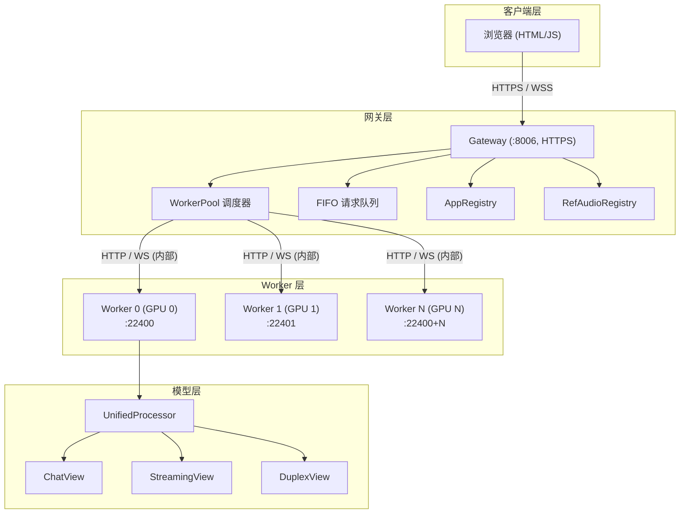
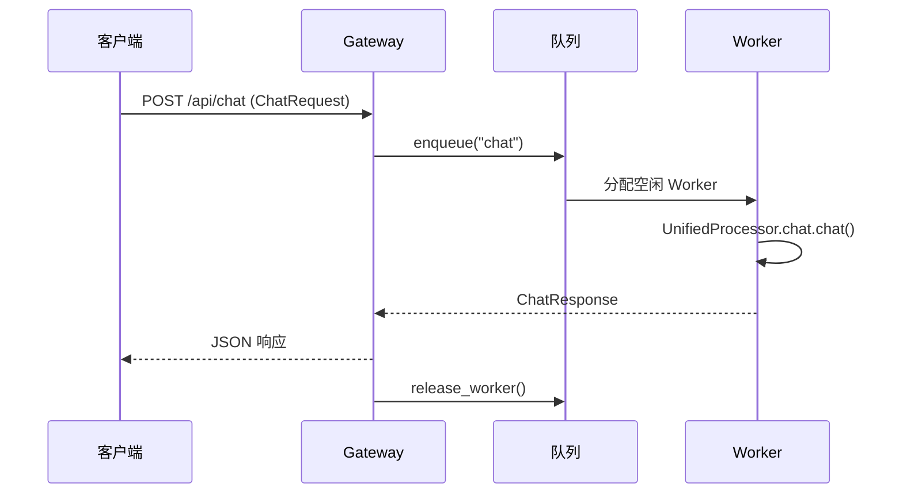
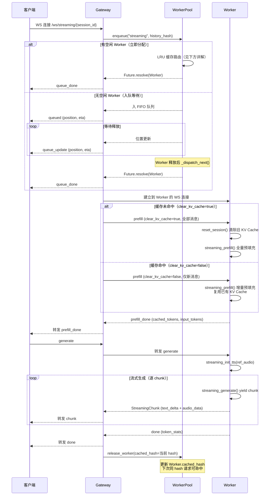
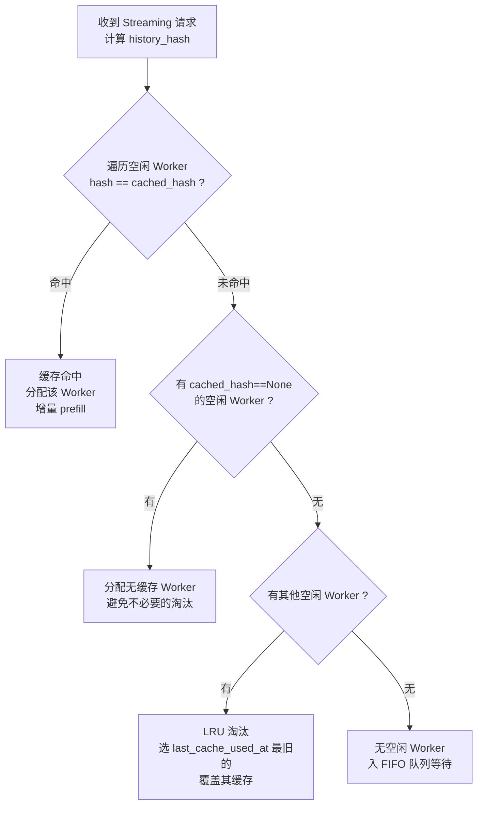
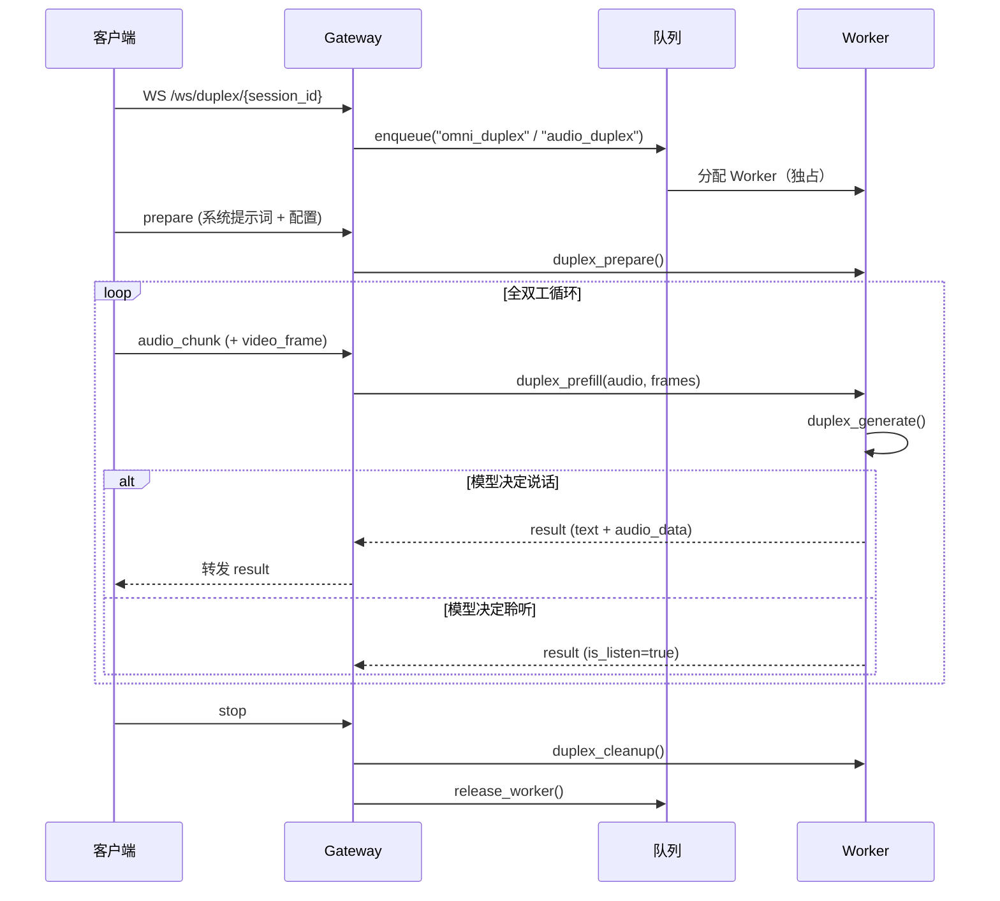
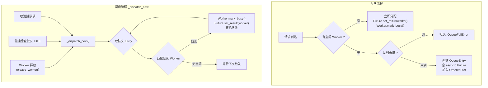
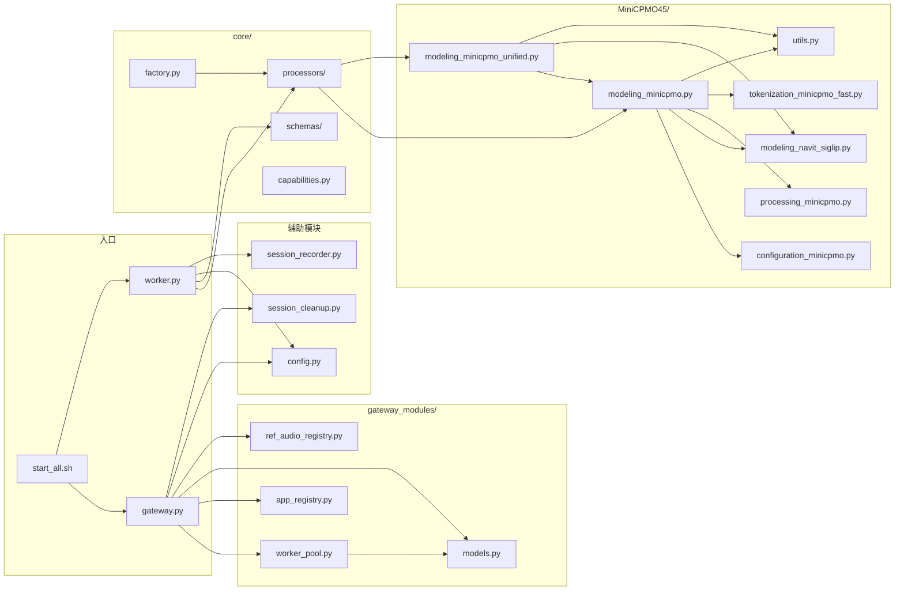
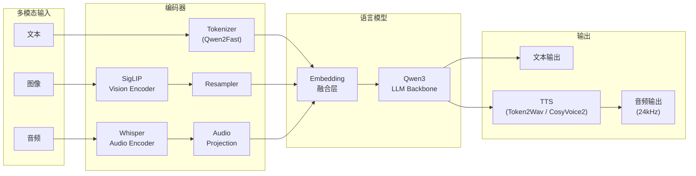
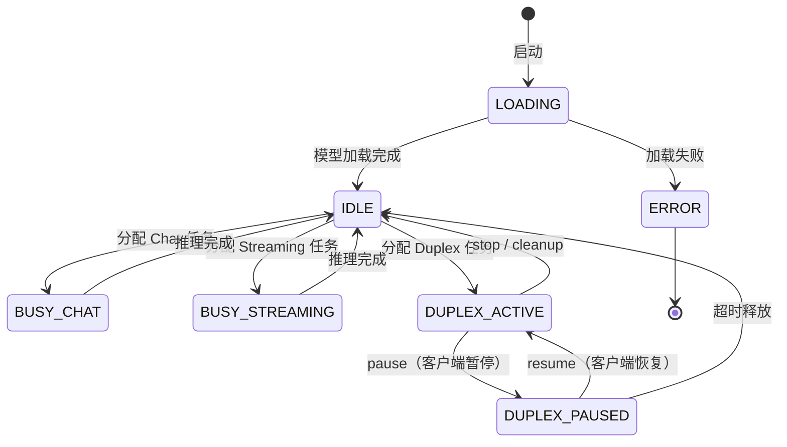
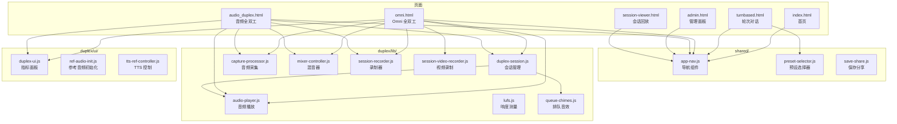

# 系统架构与拓扑

## 整体架构

系统采用 **Frontend - Gateway - Worker Pool** 三层架构：

### 各层职责

| 层 | 组件 | 职责 |
|----|------|------|
| **客户端层** | 浏览器前端 | 模式选择、音视频采集、WebSocket 通信、会话录制 |
| **网关层** | Gateway | 请求路由分发、WebSocket 代理、FIFO 排队、会话亲和、ETA 估算 |
| **Worker 层** | Worker x N | 每 Worker 独占一张 GPU，执行模型推理，管理 KV Cache |
| **模型层** | UnifiedProcessor | 统一模型加载，三种模式毫秒级热切换 |

## 请求处理流程

### Chat 模式（无状态 HTTP）

### Streaming 模式（WebSocket + LRU 缓存 + KV Cache 复用）

Streaming 模式的核心优化是 **KV Cache 复用**。当同一会话的多轮对话命中同一个 Worker 时，模型只需对新增消息做增量 prefill，而非重新处理整个历史，大幅降低延迟。

#### LRU 缓存路由详解

LRU 缓存路由在 **Gateway 侧**的 `WorkerPool._route_streaming_worker()` 中实现（位于 `gateway_modules/worker_pool.py`），而非 Worker 侧。Gateway 通过 `WorkerConnection.cached_hash` 和 `last_cache_used_at` 字段追踪每个 Worker 当前缓存的会话历史 hash。

**路由 4 级优先级**：

- **hash 计算**：`compute_history_hash()` 将消息列表的 `role + content` 序列化后做 SHA-256，确保相同对话历史产生相同 hash。
- **缓存更新时机**：Gateway 在 `release_worker()` 时将当前请求的 `history_hash` 写入 `Worker.cached_hash` 和 `last_cache_used_at`，供后续请求匹配。
- **Non-Streaming 请求也考虑缓存**：Chat/Duplex 分配时也优先选无缓存的 Worker（`_get_idle_worker()`），避免不必要地淘汰 Streaming 的缓存。

### Duplex 模式（WebSocket + 独占 Worker）

## FIFO 队列与 Worker 通信机制

队列在 Gateway 侧的 `WorkerPool` 中实现，使用 `OrderedDict` 保证 FIFO 顺序。核心通信机制如下：

**关键设计**：

1. **asyncio.Future 桥接**：每个排队请求持有一个 `asyncio.Future`，Gateway 的 WebSocket handler 通过 `await future` 阻塞等待分配结果。Worker 空闲时 `_dispatch_next()` 调用 `future.set_result(worker)` 唤醒等待者。
2. **单一调度点**：所有 Worker 分配都通过 `_dispatch_next()` 进行，在 Worker 释放、排队取消、健康检查恢复后触发，消除并发竞争。
3. **立即标记忙碌**：分配 Worker 时立即调用 `mark_busy()` 将状态改为忙碌，防止同一 Worker 被重复分配给多个请求。
4. **Gateway → Worker 通信**：Gateway 通过 HTTP（Chat）或 WebSocket（Streaming/Duplex）直连 Worker 的内部端口（22400+），不经过队列。队列只负责 Worker 分配，不参与数据传输。

## 模块依赖拓扑

## 模型推理管线

## Worker 状态机

## 前端组件拓扑

