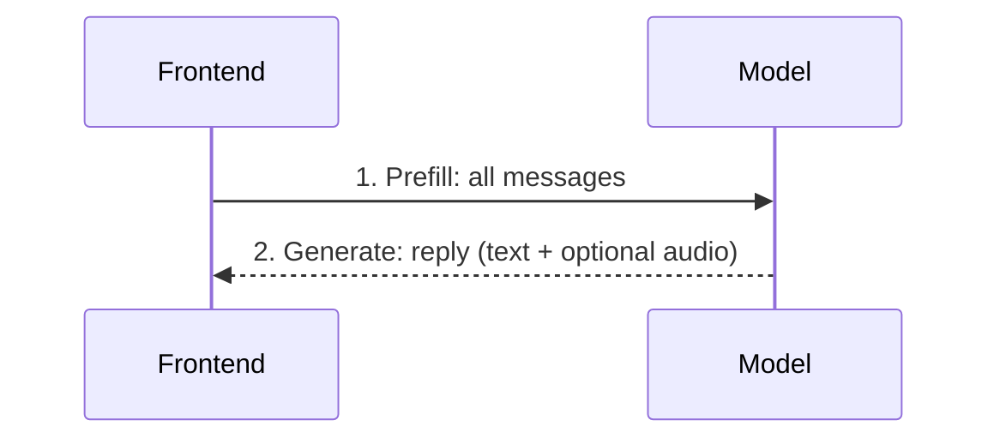
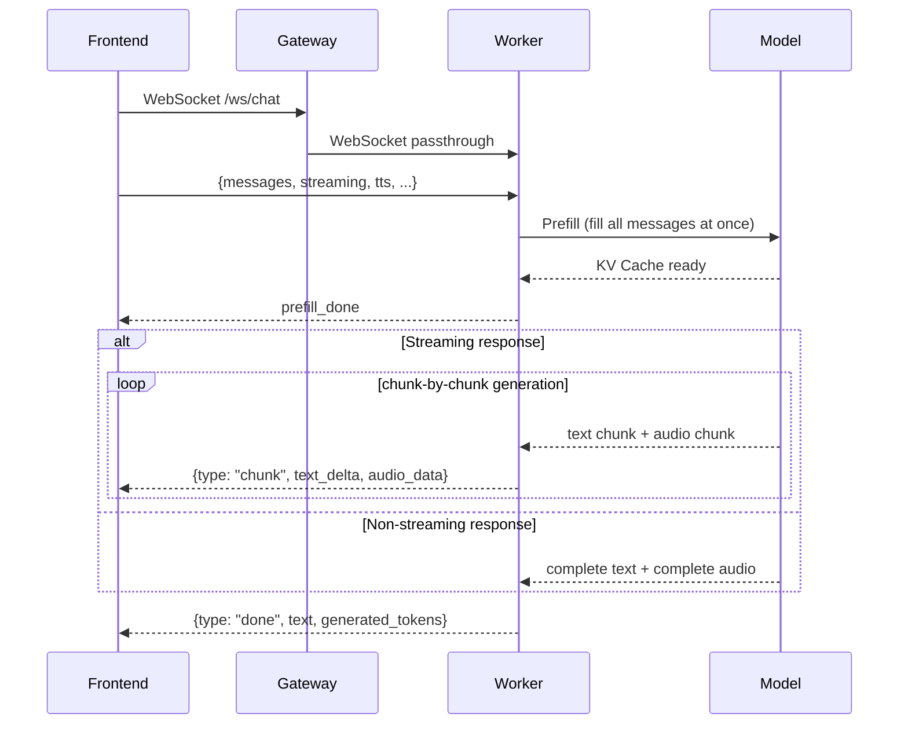

# Chat Mode Details

The core inference mode behind the Turn-based Chat page. Communicates via the `/ws/chat` WebSocket endpoint, supporting both **streaming** and **non-streaming** response modes.

## In One Sentence

> Feed all history messages into the model at once (**Prefill**), then let the model generate a reply based on the existing context (**Generate**).

## Overall Flow

### Simplified View

Only two steps between the frontend and the model:



### Detailed View

Full flow with the intermediate layers (Gateway passthrough proxy + Worker dispatch):



## Prefill Stage

Prefill fills the entire conversation history (system prompt + multi-turn user/assistant messages) into the model's **KV Cache** in one shot.

Key behaviors:
- Uses `apply_chat_template` to build the prompt, but **without generation prompt** (`add_generation_prompt=False`)
- The generation prompt (`<|im_start|>assistant\n`) is injected during the Generate stage
- Supports multimodal input: text, images, audio, video

```python
# Pseudocode
prompt = tokenizer.apply_chat_template(msgs, add_generation_prompt=False)
inputs = processor(prompt, images, audios)
inputs_embeds = get_vllm_embedding(inputs)   # vision encoding
inputs_embeds = get_omni_embedding(inputs)   # audio encoding

# Fill KV Cache
outputs = llm(inputs_embeds=inputs_embeds, use_cache=True)
kv_cache = outputs.past_key_values
```

## Generate Stage

Generate produces a reply based on the filled KV Cache. It first injects the bos string, then branches:

### Bos String Injection

```
<|im_end|>\n<|im_start|>assistant\n<think>\n\n</think>\n\n<|tts_bos|>
```

This is consistent with the model's behavior in `chat()` and `streaming_generate()`.

### Non-streaming Generation

Uses HuggingFace's standard `llm.generate()` API:

1. bos string → embedding → KV Cache forward pass
2. `llm.generate(past_key_values=kv_cache, ...)` generates the complete sequence
3. Decode text
4. Optional: call `_generate_speech_non_streaming()` for TTS audio

Best for: short replies, scenarios that don't require real-time feedback.

### Streaming Generation

Uses the model's internal `streaming_generate()` method:

1. bos string is auto-injected
2. Generates in groups of 10 tokens (`ChunkPrefillChunkGenerate`)
3. Each token group is fed to TTS to produce an audio chunk
4. Yields (waveform_chunk, text_delta) incrementally

Best for: long replies, scenarios that need real-time token-by-token display.

## WebSocket Protocol

### Endpoint

```
wss://host/ws/chat
```

### Request Format

Send one JSON message after connecting:

```json
{
  "messages": [
    {"role": "system", "content": [{"type": "text", "text": "..."}]},
    {"role": "user", "content": "Hello"}
  ],
  "streaming": true,
  "generation": {"max_new_tokens": 256, "length_penalty": 1.1},
  "tts": {"enabled": true, "ref_audio_data": "<base64>"},
  "image": {"max_slice_nums": null},
  "omni_mode": false
}
```

| Field | Description |
|-------|-------------|
| `messages` | Complete message history (including system prompt) |
| `streaming` | `true` for streaming / `false` for non-streaming |
| `generation` | Generation parameters (max_new_tokens, length_penalty, etc.) |
| `tts` | Voice Response config (enabled, ref_audio_data) |
| `omni_mode` | Set to `true` for video input |

### Response Messages

| Type | Fields | Description |
|------|--------|-------------|
| `prefill_done` | `input_tokens` | Prefill complete, returns input token count |
| `chunk` | `text_delta`, `audio_data` | One streaming chunk (streaming=true only) |
| `done` | `text`, `generated_tokens`, `input_tokens`, `audio_data` | Generation complete |
| `error` | `error` | Error message |

## Call Chain

```
Frontend turnbased.html
  └─ WebSocket /ws/chat
      └─ Gateway (WS passthrough proxy)
          └─ Worker /ws/chat
              ├─ chat_prefill()
              │   └─ ChatView.prefill()
              │       └─ model.non_streaming_prefill()
              ├─ TTS init
              │   └─ model.init_token2wav_cache()
              └─ Generation
                  ├─ Streaming: chat_streaming_generate()
                  │   └─ ChatView.streaming_generate()
                  │       └─ model.streaming_generate()
                  └─ Non-streaming: chat_non_streaming_generate()
                      └─ ChatView.generate()
                          └─ model.non_streaming_generate()
```

## Voice Response

The frontend provides a "Voice Response" toggle:

| State | Behavior |
|-------|----------|
| On | Generates voice reply + text; automatically suppresses special characters (Markdown `*`, `#`, code symbols, etc.) to ensure text is suitable for voice playback |
| Off | Text-only generation; no character suppression, Markdown, code, etc. can be freely output |

Technical detail: The `suppress_forbidden_tokens` parameter in `ChunkPrefillChunkGenerate.chunk_generate()` is controlled by `generate_audio`.

## Video Input

Chat mode supports video input (`VideoContent`):

1. Frontend uploads a video file → Base64 encoding
2. Processor decodes to a temp file → `get_video_frame_audio_segments()` extracts frames and audio
3. Frames and audio are interleaved (frame, audio, [stacked_frame], ...) and fed to the model
4. Request automatically sets `omni_mode: true`, `max_slice_nums: 1`
