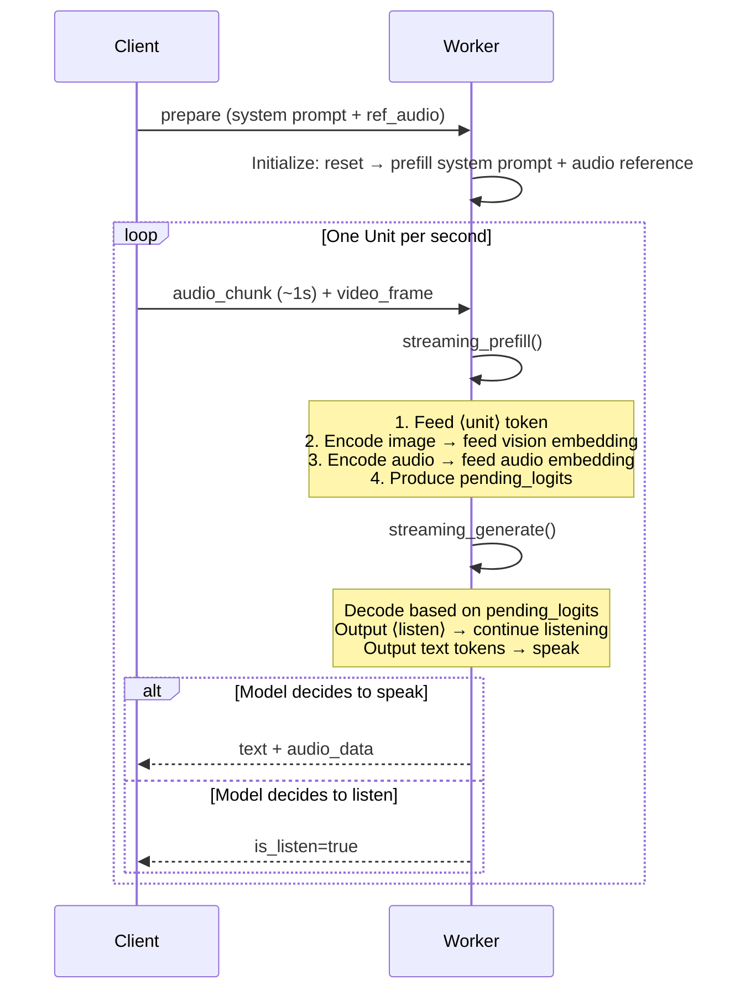
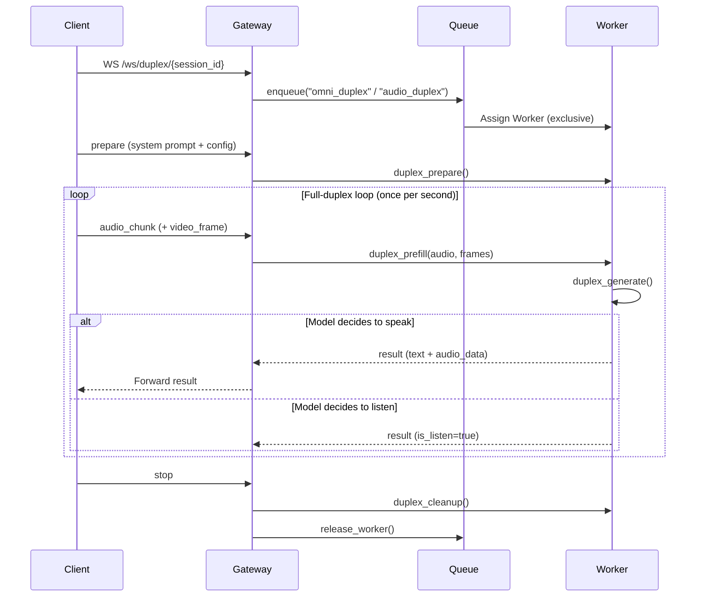

# Duplex Mode Details

The Duplex endpoint (`/ws/duplex/{session_id}`) supports two full-duplex interaction modes:

- **Omnimodal Full-Duplex**: Sends `audio_chunk` + `video_frame` every second; the model processes both vision and voice simultaneously
- **Audio Full-Duplex**: Sends only `audio_chunk` every second; no visual input

Both share the same prefill-generate unit loop, differing only in whether video frames are provided.

## Basic Concepts

Duplex (full-duplex) mode delivers a real-time conversational experience similar to a phone call: while the user is speaking, the model can respond at any time without waiting for the user to finish.

Key differences from Streaming mode:

| | Streaming Mode | Duplex Mode |
|---|---|---|
| Interaction | Turn-based (user finishes → model responds) | Real-time full-duplex (listens and responds simultaneously) |
| Input processing | One-time prefill of complete message | Per-second streaming prefill of audio/video |
| Worker occupation | Occupied only during inference, released upon completion | Exclusively occupied for the entire session |
| Use cases | Text/multimodal Q&A | Real-time voice/video conversation |

## Per-Second Unit Loop

The core of Duplex is a prefill-generate loop that **executes once per second**, with each iteration called a "unit":



`streaming_prefill()` receives an audio segment (and optional video frames) each second, encodes them, and feeds them into the LLM's KV Cache:

```python
# MiniCPMO45/modeling_minicpmo_unified.py — DuplexCapability.streaming_prefill()
# Called once per second; determines mode based on input: AUDIO / VISION / OMNI

# Step 1: Feed <unit> token (marks the start of a new unit)
self.decoder.feed(self.decoder.embed_token(self.unit_token_id))

# Step 2: Encode image → feed vision embedding (if video frames present)
vision_hidden_states = self.model.get_vision_embedding(processed_frames)
self.decoder.feed(vision_embed)

# Step 3: Encode audio → feed audio embedding
audio_embeds = self.model.get_audio_embedding(processed_audio)
self.decoder.feed(audio_embed)
# → Produces pending_logits for use by generate
```

`streaming_generate()` decodes based on `pending_logits`, and the model autonomously decides whether to "listen" or "speak":

```python
# MiniCPMO45/modeling_minicpmo_unified.py — DuplexCapability.streaming_generate()
logits = self.pending_logits
for j in range(max_new_speak_tokens_per_chunk):
    last_id = self.decoder.decode(logits=logits, mode=decode_mode, ...)

    is_listen = last_id.item() == self.listen_token_id
    if last_id.item() in self.chunk_terminator_token_ids:
        break  # Current chunk ends (listen / chunk_eos / turn_eos)
    else:
        self.res_ids.append(last_id.item())  # Record spoken token
        self.speak_count += 1
        logits, hidden = self.decoder.feed(...)  # Feed token, get next logits
```

## Full Flow (with Queuing + Gateway Proxy)



## Omnimodal vs Audio Mode

The Gateway distinguishes between the two modes via `task_type` at enqueue time:

| | Omnimodal Full-Duplex | Audio Full-Duplex |
|---|---|---|
| Enqueue task_type | `omni_duplex` | `audio_duplex` |
| Frontend page | `omni.html` | `audio_duplex.html` |
| Sent per second | `audio_chunk` + `video_frame` | `audio_chunk` |
| `streaming_prefill()` mode | OMNI (audio + vision) | AUDIO (audio only) |
| Vision encoding | SigLIP → Resampler → feed | Skipped |

Both modes share the exact same code path on the Worker side. `DuplexCapability.streaming_prefill()` automatically selects the mode (AUDIO / VISION / OMNI) based on whether `frame_list` is provided.

## Worker-Side Processing Details

Duplex is the most complex exclusive mode — the Worker is exclusively occupied for the entire session duration.

### Prepare Phase

1. Set state → `DUPLEX_ACTIVE` (exclusive Worker)
2. Decode LLM ref_audio and TTS ref_audio (they can differ):
   - LLM ref_audio → embedded in system prompt
   - TTS ref_audio → initializes the vocoder
3. `duplex_prepare(system_prompt, ref_audio, tts_audio)` initializes the duplex session
4. Initialize `DuplexSessionRecorder` (optional)
5. Send `prepared`

### Full-Duplex Loop

Each loop iteration processes one audio chunk (~1 second):

1. Decode `audio_base64` → float32 audio waveform (16kHz)
2. Decode `frame_base64_list` → PIL Image list (Omni mode only)
3. Wait for previous round's finalize to complete (`asyncio.Event` barrier)
4. Execute in thread:
   - `duplex_prefill(audio, frames)` — prefill audio + video
   - `duplex_generate(force_listen)` — model decides to listen or speak
5. Send `result` (with `is_listen`, `text`, `audio_data`, performance metrics, `kv_cache_length`)
6. **Deferred Finalize** (enabled by default):
   - Send result to client first (overlap network transmission)
   - Execute `duplex_finalize()` asynchronously (~37ms, feed terminators + sliding window maintenance)
   - Guaranteed to complete before next round's prefill via `asyncio.Event` barrier
   - Measured improvement: LISTEN wall_clock reduced by ~30ms, SPEAK reduced by ~50ms

### Pause and Resume

- `pause` → `DUPLEX_PAUSED` + start timeout watchdog
- `resume` → `DUPLEX_ACTIVE` + cancel watchdog
- Timeout (default 60s) → automatically release Worker, notify client

### Stop and Resource Cleanup

- `stop` → `duplex_stop()`
- `finally` block (whether normal or abnormal termination):
  - `duplex_stop()` stops generation
  - `duplex_cleanup()` releases GPU resources:
    - Release KV Cache, TTS caches, etc.
    - `gc.collect()` + `torch.cuda.empty_cache()`
    - Releases ~1.5GB VRAM (diagnostic data: ~1,591 MB leaked after stop → ~48 MB remaining after cleanup)
  - Restore state → `IDLE`
