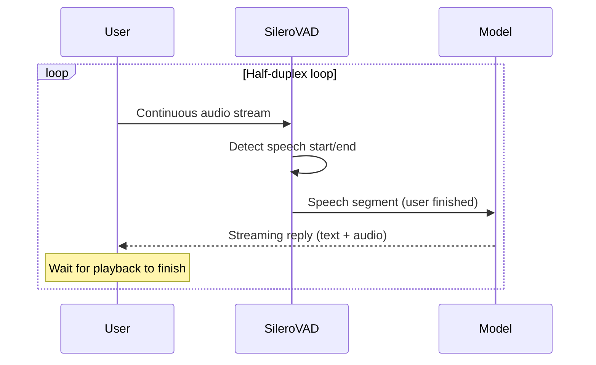
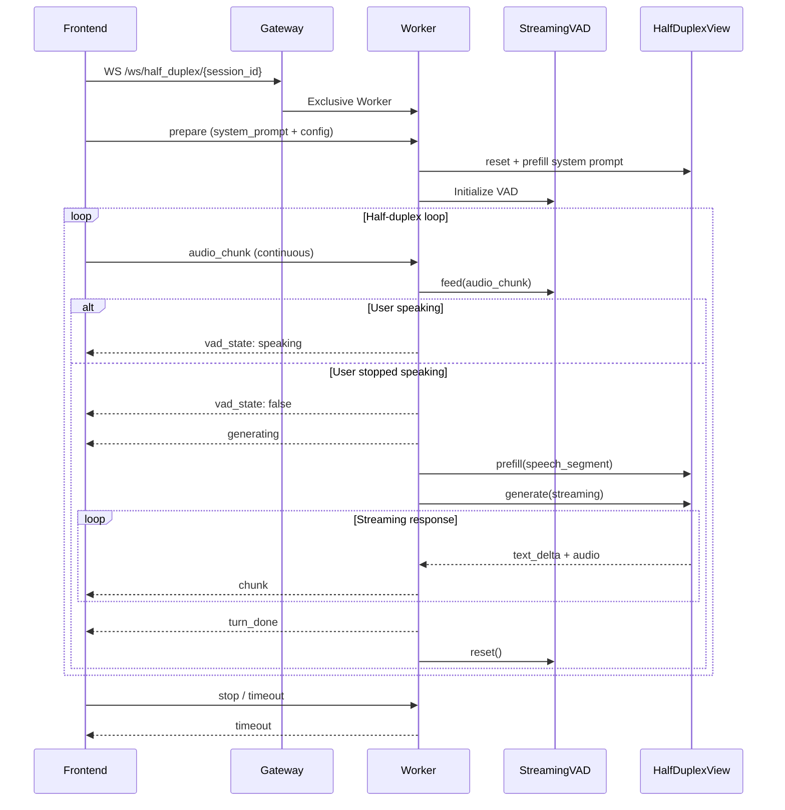

# Half-Duplex Audio Mode Details

The core inference mode behind the Half-Duplex Audio page. Communicates via the `/ws/half_duplex/{session_id}` WebSocket endpoint, implementing VAD-based half-duplex voice conversation.

## In One Sentence

> VAD automatically detects when the user finishes speaking, feeds the speech segment to the model for reply generation, waits for playback to complete, then resumes listening — like a phone call with turn-taking.

## Comparison with Other Modes

| | Chat Mode | Half-Duplex Mode | Duplex Mode |
|---|---|---|---|
| Interaction | Turn-based (manual trigger) | Turn-based (VAD auto-trigger) | Full-duplex (simultaneous) |
| Input processing | One-shot prefill of all messages | VAD detects speech segment -> prefill | Per-second streaming prefill of audio/video |
| Worker occupation | Inference duration only, released after | Exclusive for entire session (default 3 min) | Exclusive for entire session |
| Voice detection | None (frontend manual recording) | Server-side SileroVAD | None (model decides autonomously) |
| Use case | Text/multimodal Q&A | Voice conversation, hands-free | Real-time voice/video conversation |

## Overall Flow

### Simplified View



### Detailed View



## VAD Stage

The core of Half-Duplex is server-side VAD (Voice Activity Detection) using the SileroVAD ONNX model for real-time speech detection.

### StreamingVAD

The `StreamingVAD` class in `vad/vad.py` encapsulates streaming VAD logic:

```python
vad = StreamingVAD(options=StreamingVadOptions(
    threshold=0.8,              # Speech probability threshold
    min_speech_duration_ms=128, # Minimum speech segment length
    min_silence_duration_ms=800,# Minimum silence to confirm end of speech
    speech_pad_ms=30,           # Padding on each side of speech segment
))

# Feed chunks incrementally
for audio_chunk in audio_stream:
    speech_segment = vad.feed(audio_chunk)  # float32, 16kHz
    if speech_segment is not None:
        # User finished speaking
        model.prefill(speech_segment)
        model.generate()
```

### How It Works

1. Frontend sends an `audio_chunk` every 0.5 seconds (16kHz float32 PCM)
2. `StreamingVAD.feed()` slides a 1024-sample window, calling SileroVAD for speech probability on each window
3. Probability >= threshold: mark "speech started", accumulate audio to buffer
4. Probability < (threshold - 0.15) sustained for >= min_silence_duration_ms: confirm "speech ended"
5. Return accumulated speech segment, reset VAD state

### False Trigger Prevention

- **Cold start guard**: Ignore all VAD for 0.5s after `prepare` to avoid mic initialization noise
- **AI playback suppression**: Frontend stops sending `audio_chunk` while AI audio is playing to prevent echo feedback
- **Post-playback delay**: After `turn_done`, wait for AI audio to finish + 800ms buffer before resuming

## Prefill + Generate Stage

After VAD detects a speech segment, `HalfDuplexView` handles inference. It reuses the model's `streaming_prefill` + `streaming_generate` capabilities:

1. Speech segment -> Base64 encode -> `AudioContent` -> `Message(role=USER)`
2. `HalfDuplexView.prefill(request)` — prefill user speech into KV Cache
3. `HalfDuplexView.generate()` — streaming generation of text + audio chunks
4. Each chunk sent to frontend via WebSocket

KV Cache persists throughout the session, supporting multi-turn context accumulation.

## WebSocket Protocol

### Endpoint

```
wss://host/ws/half_duplex/{session_id}
```

Gateway proxies this connection to a Worker, which is exclusively occupied for the entire session.

### Client -> Server

| Type | Fields | Description |
|------|--------|-------------|
| `prepare` | `system_prompt`, `config`, `ref_audio_base64`, `system_content` | Initialize session |
| `audio_chunk` | `audio_base64` | Send mic audio (float32 PCM 16kHz) |
| `stop` | — | Stop session |

`config` structure:

```json
{
  "vad": {"threshold": 0.8, "min_speech_duration_ms": 128, "min_silence_duration_ms": 800, "speech_pad_ms": 30},
  "generation": {"max_new_tokens": 256, "length_penalty": 1.1, "temperature": 0.7},
  "tts": {"enabled": true},
  "session": {"timeout_s": 180}
}
```

### Server -> Client

| Type | Fields | Description |
|------|--------|-------------|
| `queued` | `position`, `estimated_wait_s` | Queued |
| `queue_done` | — | Left queue |
| `prepared` | `session_id`, `timeout_s`, `recording_session_id` | Ready |
| `vad_state` | `speaking` | VAD state change (user started/stopped speaking) |
| `generating` | `speech_duration_ms` | Starting reply generation |
| `chunk` | `text_delta`, `audio_data` | One streaming chunk |
| `turn_done` | `turn_index`, `text` | Turn generation complete |
| `timeout` | `elapsed_s` | Session timeout |
| `error` | `error` | Error message |

## Call Chain

```
Frontend half_duplex.html
  └─ WebSocket /ws/half_duplex/{session_id}
      └─ Gateway (exclusive WS proxy)
          └─ Worker /ws/half_duplex
              ├─ prepare
              │   ├─ StreamingVAD init
              │   ├─ HalfDuplexView.prefill(system_prompt)
              │   ├─ TTS init (ref_audio)
              │   └─ TurnBasedSessionRecorder init
              └─ audio_chunk loop
                  ├─ StreamingVAD.feed(chunk)
                  ├─ Speech detected → HalfDuplexView.prefill(user_audio)
                  ├─ HalfDuplexView.generate() → streaming chunks
                  └─ VAD reset + wait for next turn
```

## Frontend Parameter Pass-through

Settings panel parameters are sent to the backend via the `config` field in the `prepare` message. Parameters are saved to `localStorage` and only sent at session start — mid-session changes do not take effect.

| Category | Parameter | Default | Description |
|----------|-----------|---------|-------------|
| VAD | threshold | 0.8 | Speech detection threshold (higher = stricter) |
| VAD | min_speech_duration_ms | 128 | Minimum speech segment length |
| VAD | min_silence_duration_ms | 800 | Silence duration to confirm end of speech |
| VAD | speech_pad_ms | 30 | Padding on each side of speech segment |
| Generation | max_new_tokens | 256 | Maximum generated tokens |
| Generation | length_penalty | 1.1 | Length penalty coefficient |
| Generation | temperature | 0.7 | Sampling temperature |
| TTS | enabled | true | Enable voice response |
| Session | timeout_s | 180 | Session timeout (seconds) |
