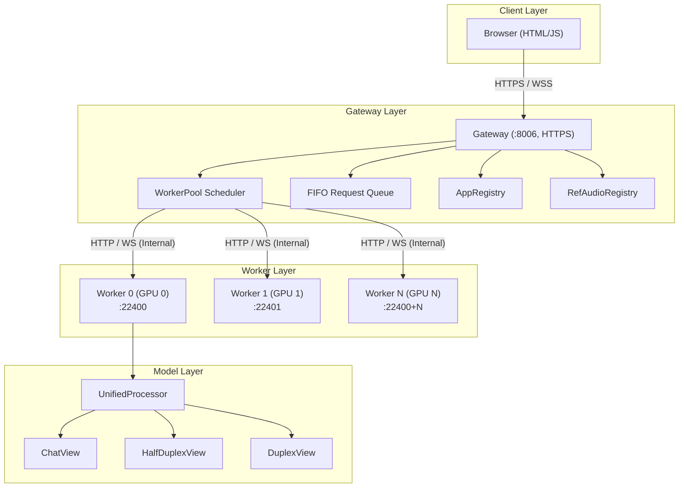
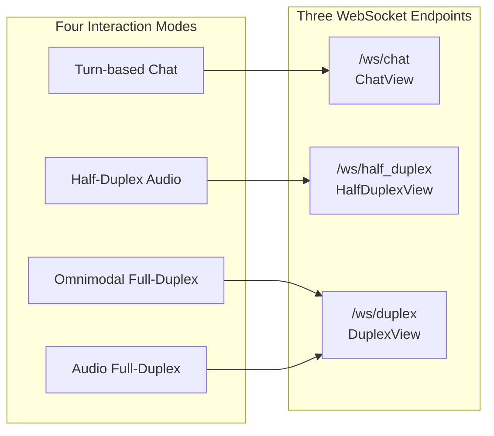

# System Architecture Overview

## Overall Architecture

The system adopts a **Frontend - Gateway - Worker Pool** three-tier architecture:

### Responsibilities of Each Layer

| Layer | Component | Responsibilities |
|-------|-----------|-----------------|
| **Client Layer** | Browser Frontend | Mode selection, audio/video capture, WebSocket communication, session recording |
| **Gateway Layer** | Gateway | Request routing & dispatch, WebSocket proxy, FIFO queuing, session affinity, ETA estimation |
| **Worker Layer** | Worker x N | Each Worker owns a dedicated GPU, performs model inference, manages KV Cache |
| **Model Layer** | UnifiedProcessor | Unified model loading, millisecond-level hot-switching between Chat / Half-Duplex / Duplex |

## Four Interaction Modes

The system provides four interaction modes, sharing **three WebSocket endpoints** under the hood:

| Mode | Features | Input Modalities | Output Modalities | Interaction Paradigm | Endpoint |
|------|----------|------------------|-------------------|---------------------|----------|
| **Turn-based Chat** | Low-latency streaming interaction, reply triggered by button or VAD, strong base capabilities | Audio + Text + Image + Video | Audio + Text | Turn-based dialogue | ChatView |
| **Half-Duplex Audio** | VAD auto-detects speech boundaries, hands-free voice conversation | Voice | Text + Voice | Half-duplex | HalfDuplexView |
| **Omnimodal Full-Duplex** | Full-modality full-duplex, vision + voice input and voice output occur simultaneously | Vision + Voice | Text + Voice | Full-duplex | DuplexView |
| **Audio Full-Duplex** | Voice full-duplex, voice input and output occur simultaneously | Voice | Text + Voice | Full-duplex | DuplexView |

### Chat Endpoint — Turn-based Chat

Turn-based Chat uses **ChatView** (`/ws/chat` WebSocket) to implement turn-based multimodal dialogue.

ChatView splits inference into prefill and generate stages: prefill fills all messages into the KV Cache in one shot, and generate supports both streaming and non-streaming modes. The frontend can toggle the Streaming switch to choose between real-time token-by-token output or one-shot response.

See [ChatView Mode Details](chat.html) for more information.

### Half-Duplex Endpoint — Half-Duplex Audio

Half-Duplex Audio uses **HalfDuplexView** (`/ws/half_duplex/{session_id}` WebSocket) to implement VAD-based half-duplex voice conversation.

Server-side SileroVAD detects speech boundaries in real-time. After the user finishes speaking, it automatically triggers prefill + streaming generate. The Worker is exclusively occupied for the entire session (default 3-minute timeout). Frontend parameters (VAD threshold, generation params, etc.) are passed at session start.

See [Half-Duplex Mode Details](half-duplex.html) for more information.

### Duplex Endpoint — Full-Duplex

Omnimodal Full-Duplex and Audio Full-Duplex share the **Duplex endpoint** (`/ws/duplex/{session_id}`), differing only in whether video frames are sent:

- **Omnimodal Full-Duplex**: Sends `audio_chunk` + `video_frame` every second; the model processes both vision and voice simultaneously
- **Audio Full-Duplex**: Sends only `audio_chunk` every second; no visual input

Both share the same prefill-generate unit loop, and the Worker is exclusively occupied throughout the entire session.

See [Duplex Mode Details](duplex.html) for more information.
