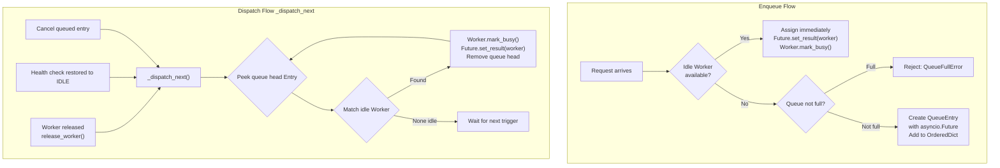
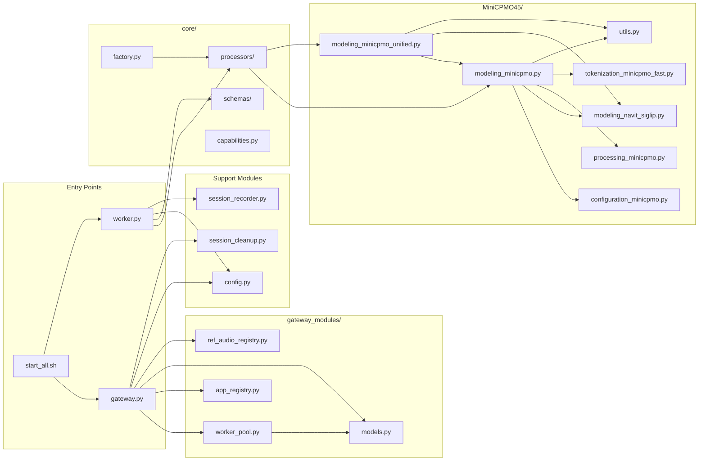
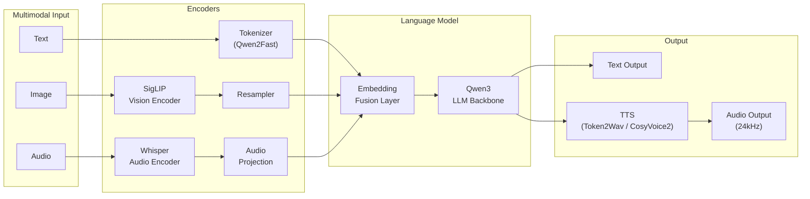
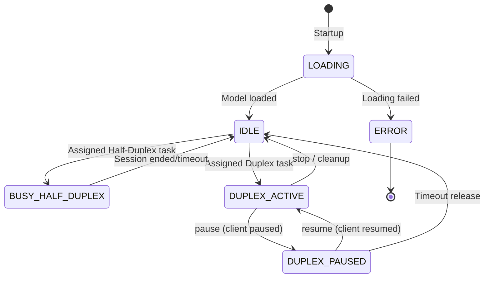

# Internals

## Worker Startup and Model Loading

Workers are built on **FastAPI**, with each Worker owning a dedicated GPU and serving HTTP and WebSocket services on a separate port.

At startup, `load_model()` (a synchronous operation, ~15s) is called within the `lifespan()` async context, using `asyncio.to_thread()` to avoid blocking the event loop. Once loading completes:

1. Create a `UnifiedProcessor` instance (loads model weights + TTS)
2. `gc.collect()` + `torch.cuda.empty_cache()` to clean up loading residuals
3. Print Device Map (confirm all components are on GPU)
4. State transitions from `LOADING` → `IDLE`

## FIFO Queue and Worker Communication

The queue is implemented in the Gateway-side `WorkerPool`, using `OrderedDict` to guarantee FIFO ordering. The core communication mechanisms are as follows:



**Key design decisions**:

1. **asyncio.Future bridging**: Each queued request holds an `asyncio.Future`. The Gateway's WebSocket handler blocks via `await future` waiting for the assignment result. When a Worker becomes idle, `_dispatch_next()` calls `future.set_result(worker)` to wake the waiter.
2. **Single dispatch point**: All Worker assignments go through `_dispatch_next()`, triggered when a Worker is released, a queue entry is cancelled, or a health check restores a Worker. This eliminates concurrency races.
3. **Immediate busy marking**: When assigning a Worker, `mark_busy()` is called immediately to set the state to busy, preventing the same Worker from being assigned to multiple requests.
4. **Gateway → Worker communication**: The Gateway connects directly to the Worker's internal port (22400+) via WebSocket (Streaming/Duplex), bypassing the queue. The queue is only responsible for Worker assignment, not data transport.

## Module Dependency Topology



## Model Inference Pipeline



## Worker State Machine



## Frontend Component Topology

```mermaid
graph TB
    subgraph pages [Pages]
        IDX["index.html\nHome"]
        TB["turnbased.html\nTurn-based Chat"]
        OM["omni.html\nOmni Full-Duplex"]
        AD["audio_duplex.html\nAudio Full-Duplex"]
        ADM["admin.html\nAdmin Panel"]
        SV["session-viewer.html\nSession Playback"]
    end

    subgraph sharedComp [shared/]
        NAV["app-nav.js\nNavigation Component"]
        PS["preset-selector.js\nPreset Selector"]
        SS["save-share.js\nSave & Share"]
    end

    subgraph duplexLib [duplex/lib/]
        DS["duplex-session.js\nSession Management"]
        APL["audio-player.js\nAudio Player"]
        CP2["capture-processor.js\nAudio Capture"]
        LU["lufs.js\nLoudness Metering"]
        MC["mixer-controller.js\nMixer Controller"]
        QC["queue-chimes.js\nQueue Chimes"]
        SRec["session-recorder.js\nRecorder"]
        SVR["session-video-recorder.js\nVideo Recorder"]
    end

    subgraph duplexUI [duplex/ui/]
        DUI["duplex-ui.js\nMetrics Panel"]
        RAI["ref-audio-init.js\nRef Audio Init"]
        TRC["tts-ref-controller.js\nTTS Controller"]
    end

    IDX --> NAV
    TB --> NAV
    TB --> PS
    OM --> NAV
    OM --> DS
    OM --> APL
    OM --> CP2
    AD --> NAV
    AD --> DS
    AD --> APL
    AD --> CP2
    ADM --> NAV
    SV --> NAV

    DS --> APL
    DS --> QC
    OM --> DUI
    AD --> DUI
    OM --> MC
    AD --> MC
    OM --> SRec
    AD --> SRec
    OM --> SVR
```



## Session Recording

`session_recorder.py` automatically records input/output data for all inference sessions, supporting subsequent playback and analysis.

### Session Directory Structure

```
data/sessions/{session_id}/
├── meta.json                # Session metadata (type, creation time, config)
├── recording.json           # Timeline recording data
├── user_audio/              # User audio chunks (WAV)
├── user_frames/             # User video frames (JPEG, Omni only)
├── ai_audio/                # AI-generated audio (WAV)
├── user_images/             # User-uploaded images (PNG)
├── merged_replay.wav        # Merged replay audio (Duplex)
└── merged_replay.mp4        # Merged replay video (Omni)
```

The recorder uses a `ThreadPoolExecutor` (4 threads) for asynchronous file writing without blocking inference.

| Recorder | Purpose |
|----------|---------|
| `DuplexSessionRecorder` | Duplex sessions, records timeline data for each chunk |
| `TurnBasedSessionRecorder` | Turn-based sessions, accumulates streaming chunks |

## Session Cleanup

`session_cleanup.py` periodically cleans up expired session data.

### Cleanup Strategy

1. **By time** — delete sessions older than `retention_days`
2. **By capacity** — when exceeding `max_storage_gb`, delete by LRU

### Execution Methods

- **Automatic**: Gateway background task, runs every 24 hours
- **Manual**: `python session_cleanup.py --data-dir data --retention-days 30 --max-storage-gb 50`
