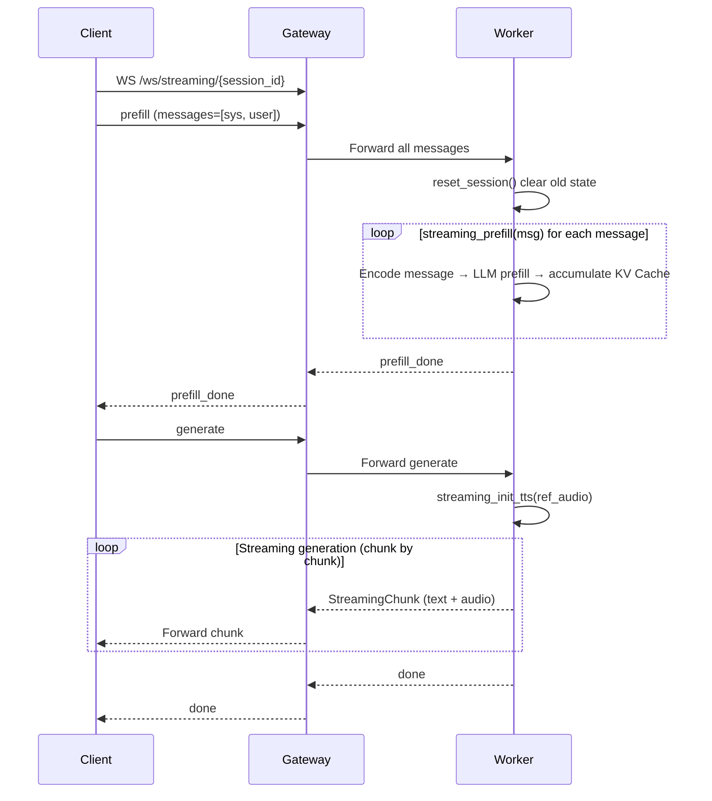
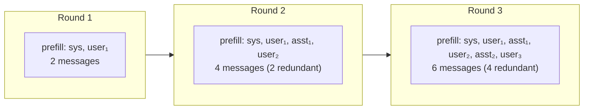
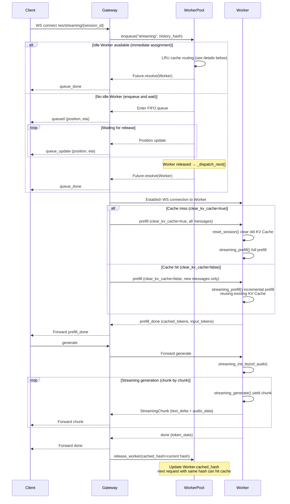
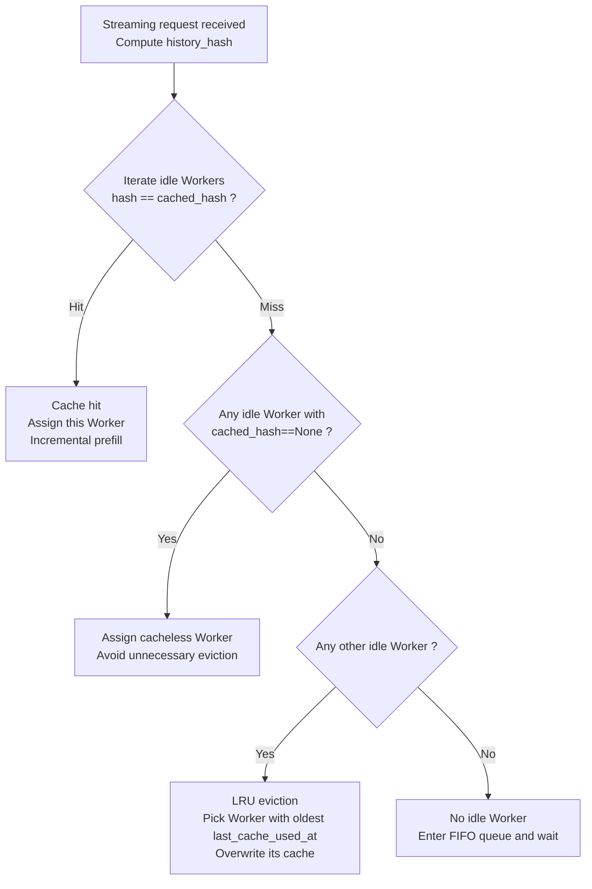

# Streaming Mode Details

Streaming mode (`/ws/streaming/{session_id}`) implements **Turn-based Chat**: after the user sends a complete message, the model streams back text + audio. The core optimization is **KV Cache reuse across turns**.

## Basic Flow

Let's first look at the simplest single-turn Streaming flow — without queuing or cache optimizations, focusing only on the core inference pipeline:



After receiving the message list, `StreamingView.prefill()` splits it into per-message calls to the model's `streaming_prefill()`:

```python
# core/processors/unified.py — StreamingView.prefill()
def prefill(self, request: StreamingRequest) -> str:
    prompt = ""
    for i, msg in enumerate(request.messages):
        content = self._convert_content_to_model_format(msg.content)
        msgs = [{"role": msg.role.value, "content": content}]
        is_last = request.is_last_chunk and (i == len(request.messages) - 1)
        result = self._model.streaming_prefill(
            session_id=request.session_id, msgs=msgs,
            is_last_chunk=is_last, stream_input=False, ...
        )
        if result:
            prompt = result
    return prompt
```

After each `streaming_prefill()` call, the model accumulates new KV pairs into `llm_past_key_values` for subsequent generation:

```python
# MiniCPMO45/modeling_minicpmo_unified.py — streaming_prefill()
cache_length = self._get_kv_cache_length()
attention_mask = torch.ones((1, cache_length + inputs_embeds.shape[1]), ...)

outputs = self.llm(
    past_key_values=self.llm_past_key_values,  # Pass in existing KV Cache
    inputs_embeds=inputs_embeds,                # Embedding of current message only
    attention_mask=attention_mask,
    use_cache=True,
)
self.llm_past_key_values = as_dynamic_cache(outputs["past_key_values"])  # Update cache
```

## Why Is KV Cache Reuse Needed?

The basic flow above has a problem: **every turn requires re-prefilling all historical messages from scratch**.



As the number of dialogue turns increases, redundant computation grows linearly. For multimodal messages containing images and audio, the cost of redundant prefilling is especially high.

**The core idea of KV Cache reuse**: After the Worker finishes inference, it **does not clear** `llm_past_key_values`. When the next turn request is routed to the same Worker, it directly reuses the existing cache and only performs incremental prefill for new messages.

## KV Cache Reuse Implementation

The reuse mechanism spans three layers: **Gateway → Worker → Model**:

### 1. Gateway: Cache Hit Detection

The Gateway computes a SHA-256 hash of historical messages (excluding the latest user message) and compares it with the Worker's previously saved `cached_hash` to determine a hit:

```python
# gateway.py — streaming_ws()
history = raw_messages[:-1]
history_hash = compute_history_hash(history) if history else ""

cache_hit = history_hash and worker.cached_hash == history_hash

if cache_hit:
    # Hit: send only the latest message, instruct the Worker to keep existing KV Cache
    forward_msg = {**msg, "messages": raw_messages[-1:], "clear_kv_cache": False}
else:
    # Miss: send all messages, instruct the Worker to clear and do full prefill
    forward_msg = {**msg, "messages": raw_messages, "clear_kv_cache": True}
```

### 2. Worker: Clear or Keep as Instructed

The Worker receives the `clear_kv_cache` field from the Gateway and decides whether to reset the model session:

```python
# worker.py — streaming_ws()
if msg.get("clear_kv_cache", False):
    worker.reset_streaming_session()
    # → streaming_view._model.reset_session(reset_token2wav_cache=False)
```

### 3. Model: Clearing Means Nullifying `llm_past_key_values`

`reset_session()` zeroes out all cache state. On a cache miss, the subsequent `streaming_prefill()` starts from an empty cache and prefills all messages; on a cache hit, the reset is skipped, and new messages are incrementally prefilled on top of the existing KV Cache.

```python
# MiniCPMO45/modeling_minicpmo_unified.py — reset_session()
def reset_session(self, reset_token2wav_cache=True):
    self.llm_past_key_values = None   # Clear LLM KV Cache
    self.audio_past_key_values = None
    self.session_id = None
    ...
```

## Full Flow (with Queuing + KV Cache Reuse)



## LRU Cache Routing Details

LRU cache routing is implemented on the **Gateway side** in `WorkerPool._route_streaming_worker()` (located in `gateway_modules/worker_pool.py`), not on the Worker side. The Gateway tracks each Worker's currently cached session history hash via the `WorkerConnection.cached_hash` and `last_cache_used_at` fields.

**4-level routing priority**:



- **Hash computation**: `compute_history_hash()` serializes the `role + content` of the message list and computes a SHA-256 hash, ensuring the same conversation history produces the same hash.
- **Cache update timing**: The Gateway writes the current request's `history_hash` to `Worker.cached_hash` and `last_cache_used_at` during `release_worker()`, for subsequent request matching.
- **Non-Streaming requests also consider cache**: Duplex assignment also preferentially selects cacheless Workers (`_get_idle_worker()`), avoiding unnecessary eviction of Streaming caches.

## Worker-Side Processing Details

The Worker uses a fixed `session_id="streaming"` to manage KV Cache state. Below are the specific implementations of the prefill / generate / stop phases in the Worker WebSocket handler.

### Prefill Phase

1. Check state (IDLE or BUSY_STREAMING)
2. Set state → `BUSY_STREAMING`
3. Check the `clear_kv_cache` flag from the Gateway:
   - `true` (cache miss) → `reset_streaming_session()` clears the KV Cache
   - `false` (cache hit) → keep existing KV Cache
4. Decode `ref_audio_base64` from the frontend → cache to `_streaming_ref_audio_cache`
5. Build the message list (supports text / audio / image multimodal content)
6. Record KV Cache length difference before and after prefill → `cached_tokens` / `input_tokens`
7. `streaming_prefill(request)` executes the prefill
8. Send `prefill_done` (with `cached_tokens`, `input_tokens`)

**KV Cache reuse key point**: `cached_tokens` represents the number of reused cache tokens. On a cache hit, `cached_tokens > 0`, meaning only new messages need incremental processing, significantly reducing time-to-first-token latency.

### Generate Phase

1. Retrieve ref audio from `_streaming_ref_audio_cache` (cached during prefill)
2. `streaming_init_tts(ref_audio)` initializes TTS
3. Run `streaming_generate()` in `run_in_executor`:
   - Generator yields `StreamingChunk` chunk by chunk
   - Each chunk is passed to the main coroutine via `asyncio.Queue`
   - Main coroutine sends each chunk to the client
   - After each yielded chunk, check `stop_event`
4. Send `done` (with full `token_stats`)
5. Restore state → `IDLE`

### Stop Control

- Each WS connection creates an independent `threading.Event`
- `threading.Event` is thread-safe across threads (asyncio thread ↔ generate worker thread)
- Triggered by `set()` when the client sends `stop` or disconnects
- HTTP `POST /streaming/stop` broadcasts to all active sessions
