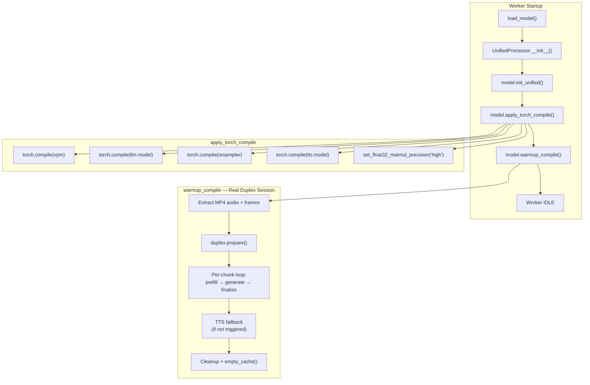

# torch.compile Acceleration

## Overview

On older-generation GPUs such as A100 and RTX 4090, the per-unit computation time in Omni Full-Duplex mode is approximately 0.9s, approaching the 1-second real-time threshold and causing noticeable stuttering.

`torch.compile` uses Triton to compile core sub-modules into optimized GPU kernels, reducing computation time to approximately **0.5s** — meeting real-time requirements for smooth, stutter-free interaction.

## How to Enable

Set in `config.json`:

```json
{
  "service": {
    "compile": true
  }
}
```

## Pre-compilation (Recommended)

The first-time compilation (cold start) takes approximately 15 minutes. To avoid this wait on the first service start, run the pre-compilation script ahead of time:

```bash
CUDA_VISIBLE_DEVICES=0 PYTHONPATH=. .venv/base/bin/python precompile.py
```

The generated Triton kernel cache is saved to the `./torch_compile_cache` directory (configured via the `TORCHINDUCTOR_CACHE_DIR` environment variable in `start_all.sh`). The cache persists on disk and is automatically reused on all subsequent starts, with no need to recompile.

After pre-compilation, start the service normally:

```bash
CUDA_VISIBLE_DEVICES=0,1,2,3 bash start_all.sh
```

Loading from cache takes approximately 5 minutes (compared to 15 minutes for cold compilation).

## Compilation Pipeline



## Compilation Targets

### Compiled Sub-modules

| Sub-module | Original Class | Reason |
|--------|--------|---------|
| `vpm` | `SiglipVisionTransformer` | Vision encoder, compute-intensive Transformer |
| `llm.model` | `Qwen3Model` | Core LLM backbone, primary inference bottleneck |
| `resampler` | `Resampler` | Visual feature resampling, Perceiver architecture |
| `tts.model` | `LlamaModel` | Core TTS backbone, audio token generation |

Only the inner backbone is compiled (e.g., `llm.model`), not the outer wrapper (e.g., `Qwen3ForCausalLM`), because the outer layer contains Python control flow (`generate()` loop), where compilation provides little benefit and easily causes graph breaks.

### Parts Not Compiled

| Sub-module | Reason |
|--------|------|
| `apm` (Whisper audio encoder) | Special streaming behavior + dynamic shapes; low compilation benefit |
| `tts.audio_tokenizer` (Token2Wav/CosyVoice2) | External library, non-standard `nn.Module` |
| `MiniCPMO` outer layer | Heavy Python control flow (chat/streaming/duplex branches); low compilation benefit |
| `lm_head` | Inside the outer wrapper, called within the generate loop |

## Compilation Parameters

| Parameter | Default | Description |
|------|--------|------|
| `mode` | `"default"` | Compilation mode |
| `dynamic` | `True` | Enable dynamic shape support |

### Compilation Modes

| Mode | Compilation Time | Runtime Speed | Use Case |
|------|---------|---------|---------|
| `default` | Moderate | Faster | Recommended; balances compilation time and runtime speed |
| `reduce-overhead` | Moderate | Fastest | Uses CUDA Graphs; only suitable for static shapes |
| `max-autotune` | Very long | Fastest | Maximum optimization; compilation may take several minutes |

The project defaults to `mode="default", dynamic=True` because sequence lengths, image sizes, etc. vary dynamically during inference. `dynamic=True` avoids recompilation when shapes change.

### TF32 Precision Boost

`torch.set_float32_matmul_precision("high")` enables TF32 matrix multiplication, providing an additional ~5-10% speedup on Ampere+ GPUs with negligible precision loss.

## warmup_compile() — Real Duplex Warmup

`torch.compile` only wraps the modules — **actual Triton kernel compilation is triggered on the first forward pass**. `warmup_compile()` runs a complete Omni Full-Duplex inference session using a real MP4 video (prepare → prefill → generate → finalize), triggering Triton compilation for all compiled sub-modules in their real execution context.

### Warmup Steps

1. **Extract media from MP4** — ffmpeg extracts 16kHz audio in 1s chunks, one frame per second
2. **Load reference audio** — for TTS voice cloning
3. **Start duplex session** — `duplex.prepare()` initializes StreamDecoder, prefills system prompt + ref audio
4. **Per-chunk inference** — each chunk runs `streaming_prefill` → `streaming_generate` → `finalize_unit`, triggering Triton compilation for vpm / resampler / llm / tts
5. **TTS fallback** — if the model stayed in LISTEN throughout and TTS was not triggered, warms up tts.model with synthetic data
6. **Cleanup** — resets duplex state, releases token2wav caches, `torch.cuda.empty_cache()`

### Warmup Logs

Each unit prints a detailed timing breakdown:

```
[warmup] unit=0/10 | prefill: vis_proc=120ms vis_emb=8500ms vis_feed=350ms
  aud_proc=45ms aud_emb=1200ms aud_feed=180ms total=10500ms |
  generate: llm=2100ms tts_prep=0ms tts=0ms token2wav=0ms total=2200ms |
  decision=LISTEN | elapsed=125s remaining~875s
```

The first chunk takes significantly longer due to Triton compilation; subsequent chunks use the already-compiled kernels and are much faster.

## Cache Mechanism

PyTorch Inductor has built-in multi-layer caching. Compilation results persist in the `TORCHINDUCTOR_CACHE_DIR` directory (project default: `./torch_compile_cache`):

| Cache Layer | Purpose | Default State |
|--------|------|---------|
| Inductor Kernel Cache | Caches generated Triton kernel .so files | Enabled by default |
| FX Graph Cache | Caches compiled FX computation graphs | Enabled by default (PyTorch 2.8+) |
| Autotune Cache | Caches kernel autotuning results | Enabled by default |

The cache is invalidated and recompilation is required when:
- PyTorch version is upgraded
- CUDA / Triton version changes
- Model code structure changes (number of layers, architecture, etc.)
- GPU architecture changes (e.g., switching from A100 to H100)

## Call Chain

```
config.json: "service": { "compile": true }
    ↓
worker.py: WORKER_CONFIG["compile"] = cfg.compile
    ↓
MiniCPMOWorker.__init__(compile=True)
    ↓
UnifiedProcessor.__init__(compile=True)
    ↓
UnifiedProcessor._load_model():
    model.init_unified()
    model.apply_torch_compile(mode="default", dynamic=True)
    model.warmup_compile(ref_audio_path=...)
```

## DuplexCapability Automatically Benefits

`DuplexCapability` accesses the model's `llm`, `vpm`, `tts`, and other sub-modules **by reference** and does not hold independent copies. After `apply_torch_compile()`, Duplex inference automatically uses the compiled versions with no additional action required.

## Performance

| Metric | Without compile | With compile |
|------|--------|--------|
| Omni Full-Duplex per-unit latency (A100) | ~0.9s | **~0.5s** |
| Additional startup time (cold compilation) | — | ~15 min |
| Additional startup time (cached) | — | ~5 min |
| Runtime VRAM usage | ~21.5 GB | ~21.5 GB |

## Known Limitations

- Certain extreme input shapes may trigger recompilation
- Requires PyTorch 2.x+; some older CUDA drivers may be incompatible with Triton
- Compiled code is difficult to step through in a debugger
