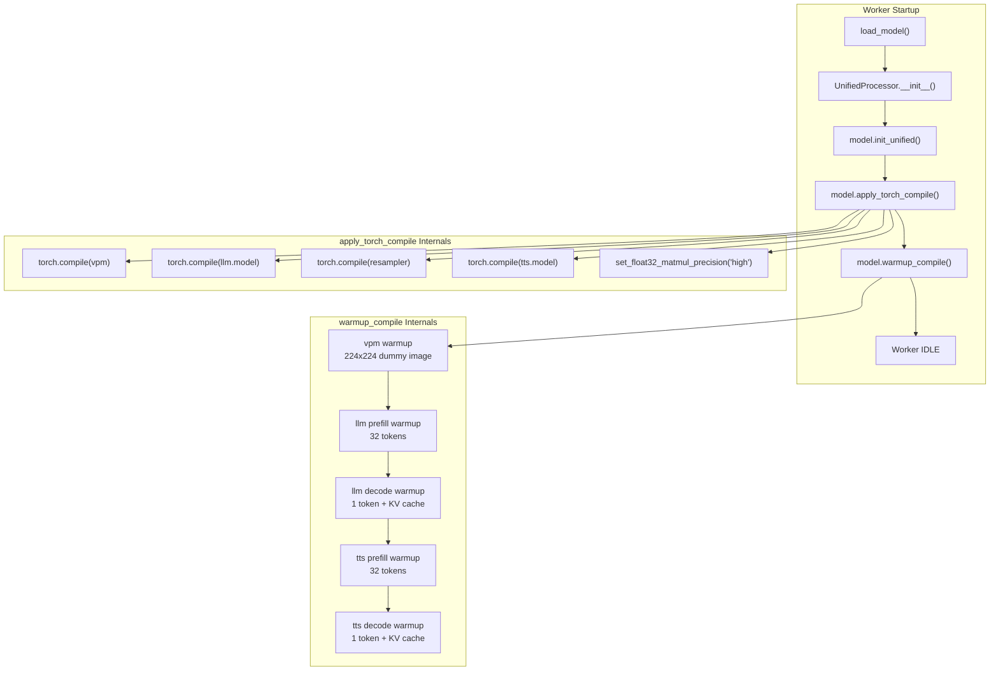

# torch.compile Acceleration

## Overview

This project supports JIT compilation acceleration of core submodules via `torch.compile`. After compilation, Triton kernels replace PyTorch eager implementations, yielding approximately 5-20% inference speedup (depending on the module and hardware).

This feature is **experimental** and disabled by default.

## How to Enable

### Command Line

```bash
bash start_all.sh --compile
```

### Configuration File

```json
{
  "service": {
    "compile": true
  }
}
```

### Standalone Worker Start

```bash
CUDA_VISIBLE_DEVICES=0 PYTHONPATH=. .venv/base/bin/python worker.py \
    --worker-index 0 --gpu-id 0 --compile
```

## Compilation Pipeline



## Compilation Targets

### Compiled Submodules

| Submodule | Original Class | Reason for Compilation |
|--------|--------|---------|
| `vpm` | `SiglipVisionTransformer` | Vision encoder, compute-intensive Transformer |
| `llm.model` | `Qwen3Model` | Core LLM backbone, primary inference bottleneck |
| `resampler` | `Resampler` | Visual feature resampling, Perceiver architecture |
| `tts.model` | `LlamaModel` | Core TTS backbone, audio token generation |

Note: Only the inner backbone is compiled (e.g., `llm.model`), not the outer wrapper (e.g., `Qwen3ForCausalLM`), because the outer layer contains Python control flow (`generate()` loop), where compilation provides little benefit and easily causes graph breaks.

### Parts Not Compiled

| Submodule | Reason |
|--------|------|
| `apm` (Whisper audio encoder) | Special streaming behavior + dynamic shapes; low compilation benefit |
| `tts.audio_tokenizer` (Token2Wav/CosyVoice2) | External library, non-standard `nn.Module` |
| `MiniCPMO` outer layer | Heavy Python control flow (chat/streaming/duplex branches); low compilation benefit |
| `lm_head` | Inside the outer wrapper, called within the generate loop |

## apply_torch_compile() Implementation

Located in `MiniCPMO45/modeling_minicpmo_unified.py`.

```python
def apply_torch_compile(self, mode="default", dynamic=True):
    compile_kwargs = dict(mode=mode, dynamic=dynamic)

    self.vpm = torch.compile(self.vpm, **compile_kwargs)
    self.llm.model = torch.compile(self.llm.model, **compile_kwargs)
    self.resampler = torch.compile(self.resampler, **compile_kwargs)
    self.tts.model = torch.compile(self.tts.model, **compile_kwargs)

    torch.set_float32_matmul_precision("high")
    self._compiled = True
```

### Compilation Parameters

| Parameter | Default | Description |
|------|--------|------|
| `mode` | `"default"` | Compilation mode |
| `dynamic` | `True` | Enable dynamic shape support |

#### Compilation Mode Selection

| Mode | Compilation Time | Runtime Speed | Use Case |
|------|---------|---------|---------|
| `default` | Moderate | Faster | Recommended; balances compilation time and runtime speed |
| `reduce-overhead` | Moderate | Fastest | Uses CUDA Graphs; only suitable for static shapes |
| `max-autotune` | Very long | Fastest | Maximum optimization; compilation may take several minutes |

The project defaults to `mode="default", dynamic=True` because sequence lengths, image sizes, etc. vary dynamically during inference. `dynamic=True` avoids recompilation when shapes change.

### TF32 Precision Boost

`torch.set_float32_matmul_precision("high")` enables TF32 (TensorFloat-32) matrix multiplication, providing an additional ~5-10% speedup on Ampere+ architecture GPUs with negligible precision loss.

## warmup_compile() Implementation

`torch.compile` only wraps the modules — **actual Triton kernel compilation is triggered on the first forward pass**. Without warmup, the first real request would incur additional compilation latency (potentially tens of seconds).

`warmup_compile()` triggers all compilation paths using synthetic data:

### Warmup Steps

**1. vpm + resampler**
- Constructs a 224x224 zero-value image (minimum size, 16x16=256 patches)
- Executes one `vpm()` + `resampler()` forward pass
- Triggers vision encoding Triton kernel compilation

**2. llm.model — prefill path**
- Constructs 32-token dummy embeddings
- Executes `llm.model(inputs_embeds=..., use_cache=True)` forward pass
- Triggers long-sequence prefill kernel compilation

**3. llm.model — decode path**
- Constructs 1-token dummy embeddings + KV cache from the previous step
- Executes decode forward pass
- Triggers single-token decode kernel compilation (a different code path from prefill)

**4. tts.model — prefill + decode paths**
- Same as llm.model, separately triggers TTS prefill and decode kernel compilation

### Why Both Paths Must Be Covered

LLM and TTS inference consists of two phases:
- **Prefill**: Processes long sequence input, no KV cache, larger matrix shapes
- **Decode**: Generates tokens one at a time, with KV cache, matrix shape of 1

These two paths have different computation graphs. If only prefill is warmed up, the first decode will still trigger a recompile.

### Post-Warmup Cleanup

```python
torch.cuda.empty_cache()
```

Temporary VRAM used during compilation is released after warmup completes.

## Call Chain

```
config.json: compile=true
    ↓
worker.py: WORKER_CONFIG["compile"] = True
    ↓
MiniCPMOWorker.__init__(compile=True)
    ↓
UnifiedProcessor.__init__(compile=True)
    ↓
UnifiedProcessor._load_model():
    model.init_unified()          # Load model + dual TTS
    model.apply_torch_compile()   # Wrap submodules
    model.warmup_compile()        # Trigger compilation
```

## DuplexCapability Automatically Benefits

The `DuplexCapability` component accesses the model's `llm`, `vpm`, `tts`, and other submodules **by reference** and does not hold independent copies. Therefore, after `apply_torch_compile()`, Duplex inference automatically uses the compiled versions with no additional action required.

## Performance & Considerations

### Time Overhead

| Phase | Duration (Typical) |
|------|---------------|
| `apply_torch_compile()` (wrapping) | ~1s |
| `warmup_compile()` (actual compilation) | ~60s |
| Total additional startup time | ~60s |

### VRAM Impact

- The compilation process temporarily uses additional VRAM (compiler intermediate representations)
- Released via `torch.cuda.empty_cache()` after warmup completes
- Runtime VRAM usage is essentially the same as non-compiled mode

### Known Limitations

- **Experimental**: Certain extreme input shapes may trigger recompilation
- **First inference latency**: If an uncovered code path is encountered, recompilation may still be triggered
- **Compatibility**: Requires PyTorch 2.x+; some older CUDA drivers may be incompatible with Triton
- **Debugging difficulty**: Compiled code is difficult to step through in a debugger

## Benchmarking

The project provides a Duplex A/B comparison benchmark script:

```bash
PYTHONPATH=. .venv/base/bin/python tests/bench_duplex_ws.py
```

This script runs multiple rounds in both normal and compile modes, collecting steady-state LISTEN/SPEAK performance statistics. It requires two Workers running simultaneously (one normal, one compile) on different ports.
