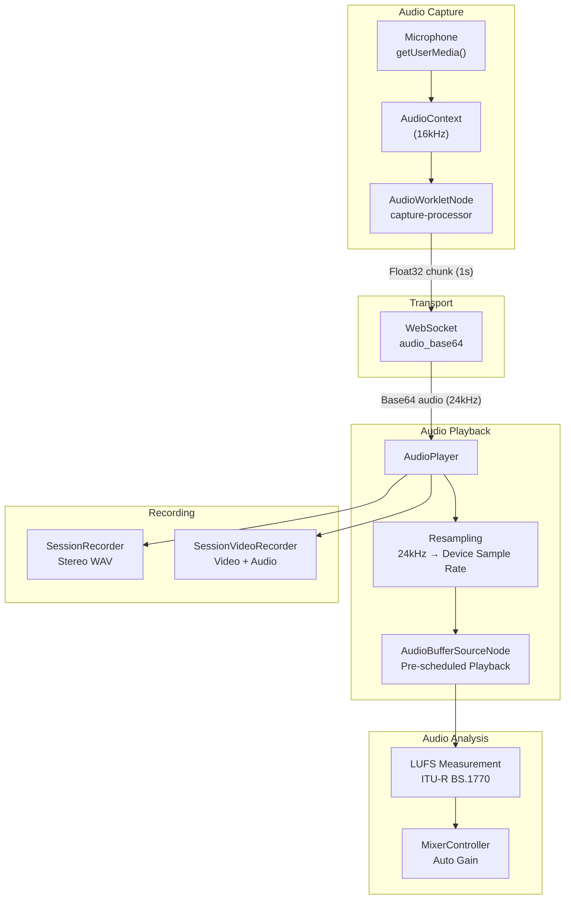
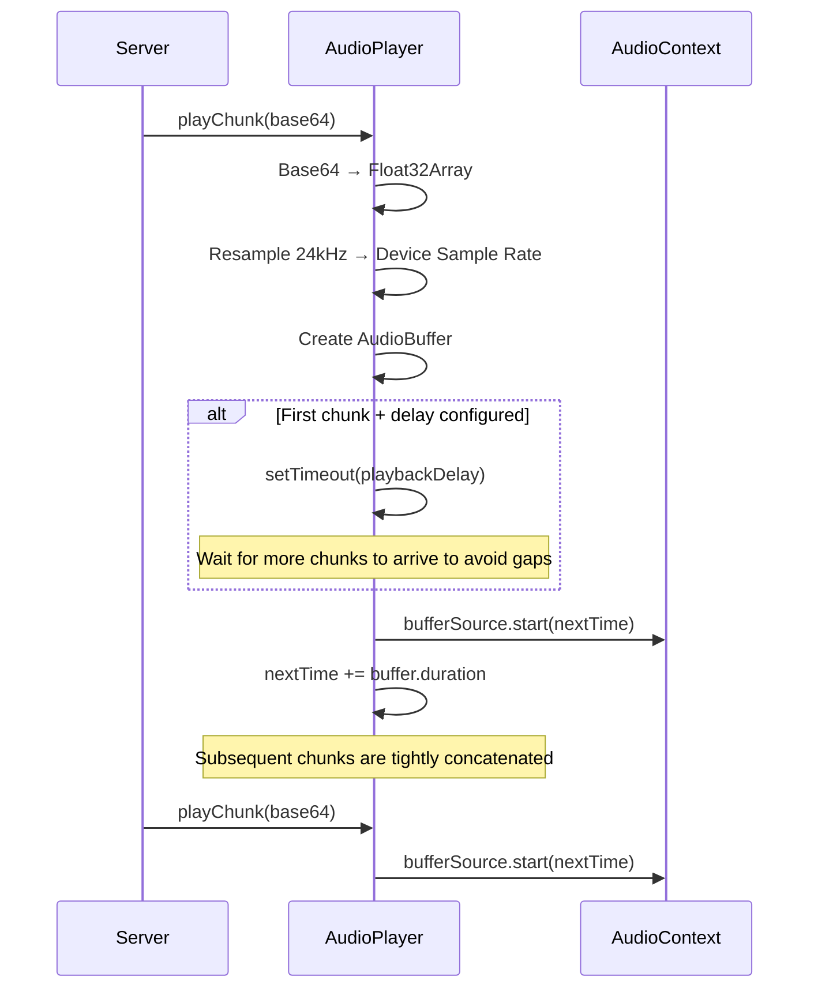

# Frontend Audio Processing Architecture

## Architecture Overview



---

## capture-processor.js — AudioWorklet Audio Capture

An `AudioWorkletProcessor` running on the Web Audio rendering thread for low-latency audio capture.

### How It Works

```javascript
process(inputs, outputs) {
    // 1. Pass through to output (for MediaStreamDestination)
    output.set(input);
    // 2. Accumulate into _buffer
    _buffer = concat(_buffer, input);
    // 3. Send when buffer fills a chunk
    while (_buffer.length >= _chunkSize) {
        const chunk = _buffer.slice(0, _chunkSize);
        _buffer = _buffer.slice(_chunkSize);
        port.postMessage({type: 'chunk', audio: chunk}, [chunk.buffer]);
    }
}
```

### Configuration

| Parameter | Default | Description |
|-----------|---------|-------------|
| `chunkSize` | 16000 | Number of samples per chunk |
| Sample rate | 16000 Hz | Determined by AudioContext `sampleRate` |
| Chunk duration | 1 second | chunkSize / sampleRate |

### MessagePort Communication

**Received commands**:
- `{command: 'start'}` — Start accumulating and sending chunks
- `{command: 'stop'}` — Stop, send remaining buffer (`final: true`)

**Sent messages**:
- `{type: 'chunk', audio: Float32Array}` — Normal chunk
- `{type: 'chunk', audio: Float32Array, final: true}` — Last chunk

Uses `Transferable` objects (`[chunk.buffer]`) for zero-copy transfer.

---

## audio-player.js — AI Audio Real-time Player

The `AudioPlayer` class manages real-time gapless playback of AI audio received from the server.

### Complete API

| Method | Description |
|--------|-------------|
| `init()` | Initialize AudioContext |
| `beginTurn()` | Start a new speaking turn (reset scheduling time) |
| `playChunk(base64Data, arrivalTime)` | Enqueue and schedule an audio chunk |
| `endTurn()` | End the current turn |
| `stopAll()` | Immediately stop all playback (used during force listen) |
| `stop()` | Full stop and cleanup |

| Property | Description |
|----------|-------------|
| `turnActive` | Whether in a speaking turn |
| `playing` | Whether audio is playing |
| `gapCount` | Total number of gaps |
| `totalShiftMs` | Total drift time |
| `lastAheadMs` | Last ahead buffer time |

### Playback Flow



### Gap Detection

A gap (buffer underrun) is detected when `nextTime < AudioContext.currentTime`:

```
gapMs = (currentTime - nextTime) * 1000
if gapMs > 10ms:
    gapCount++
    totalShiftMs += gapMs
    nextTime = currentTime + small offset    // correction
    trigger onGap callback
```

Gaps are typically caused by network latency or slow inference speed.

### Playback Delay

Configured via `getPlaybackDelayMs()` (default 200ms, corresponding to `playback_delay_ms` in `config.json`).

- Higher delay → more buffering → smoother playback, but higher first-audio latency
- Zero delay → play immediately upon receipt, may have gaps

### Callbacks

- `onMetrics(data)` — Metrics report: `{ahead, gapCount, totalShift, turn, pdelay}`
- `onGap(info)` — Gap event: `{gap_idx, gap_ms, total_shift_ms, chunk_idx, turn}`
- `onRawAudio(samples, sampleRate, timestamp)` — Raw audio data (used by SessionRecorder)

---

## lufs.js — LUFS Loudness Measurement

Implements the **ITU-R BS.1770** integrated loudness measurement algorithm.

### Algorithm Steps

1. **K-weighting filter**: Two-stage IIR filter (high-pass + high-frequency boost), simulating human ear frequency perception
2. **Block mean square**: Divide the signal into 400ms overlapping blocks and compute the mean square value of each block
3. **Absolute threshold**: Remove silent blocks below -70 LUFS
4. **Relative threshold**: Compute the mean of remaining blocks and remove blocks below the mean by -10 dB
5. **Integrated loudness**: Compute the weighted average of the final blocks → LUFS value

### Usage

- `MixerController` uses it for real-time audio level monitoring
- `FileAudioProvider` uses it for audio file normalization (adjusting gain for consistent loudness)

---

## mixer-controller.js — Mixer Control

`MixerController` provides a dual-channel audio mixing control interface.

### Features

| Feature | Description |
|---------|-------------|
| Real-time LUFS metering | Displays real-time loudness for both user and AI audio separately |
| Auto gain | Automatically adjusts AI audio volume based on LUFS |
| Independent volume control | Separate volume sliders for user/AI |
| Draggable panel | Floating panel UI, draggable to any position |

---

## duplex-utils.js — Utility Functions

| Function | Description |
|----------|-------------|
| `resampleAudio(input, srcRate, dstRate)` | Linear interpolation resampling |
| `float32ToBase64(float32Array)` | Float32 array → Base64 string |
| `base64ToFloat32(base64)` | Base64 string → Float32 array |

Resampling logic: computes the sample rate ratio and uses linear interpolation to take the weighted average of the two nearest source samples for each target sample point.

---

## stereo-recorder-processor.js — Stereo Processor

An `AudioWorkletProcessor` implementation for stereo recording in `SessionRecorder`:
- Receives two audio inputs (user + AI)
- Interleaves them into stereo frames (left = user, right = AI)
- Sends stereo PCM data via MessagePort

---

## queue-chimes.js — Queue Sound Effects

Synthesizes queue status sound effects using the Web Audio API:
- On enqueue: low-pitch tone
- On queue completion: high-pitch tone
- Purely synthesized sounds, no external audio file dependencies
