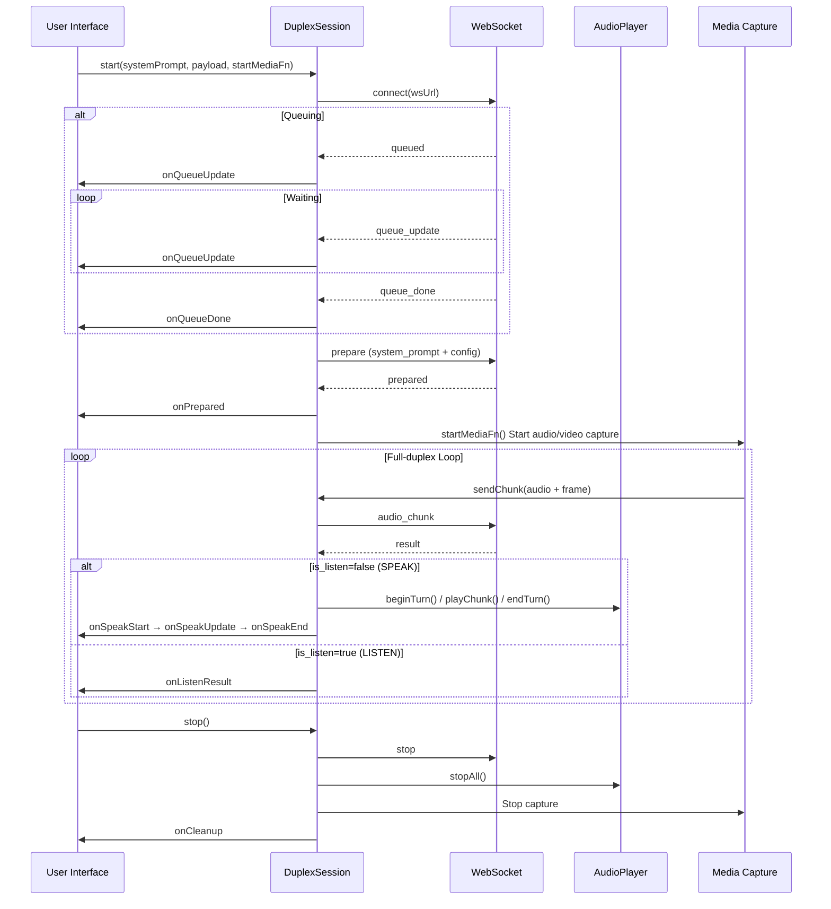
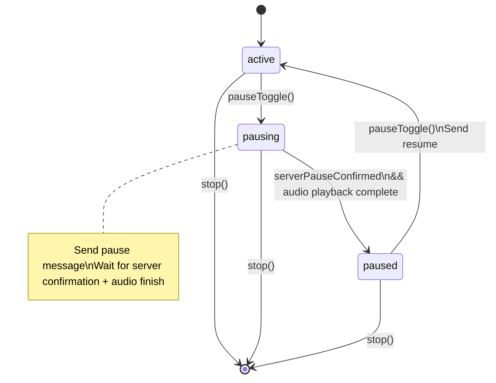

# Duplex Session Management

## DuplexSession Class

`DuplexSession` (`duplex/lib/duplex-session.js`) is the core session management class for duplex mode, encapsulating the WebSocket lifecycle, message protocol, state machine, and audio playback integration.

### Constructor

```javascript
new DuplexSession({
    prefix: 'omni',              // Session ID prefix ('omni' | 'adx')
    getMaxKvTokens: () => 8192,  // KV Cache upper limit
    getPlaybackDelayMs: () => 200,// Playback delay
    outputSampleRate: 24000,     // Audio output sample rate
    getWsUrl: (sid) => `...`,    // WebSocket URL generator
})
```

### Complete Method List

| Method | Description |
|--------|-------------|
| `start(systemPrompt, preparePayload, startMediaFn)` | Start session: connect WS → queue → prepare → start media capture |
| `sendChunk(msg)` | Send audio chunk (automatically injects `force_listen` flag) |
| `pauseToggle()` | Toggle pause/resume |
| `toggleForceListen()` | Toggle force listen mode |
| `stop()` | Stop session |
| `cancelQueue()` | Cancel queue |
| `cleanup()` | Full cleanup (WS close + AudioPlayer stop) |

### Callback Hooks

| Callback | Parameters | Trigger |
|----------|-----------|---------|
| `onSystemLog(text)` | Log text | System events (connect/disconnect/error) |
| `onQueueUpdate(data)` | `{position, eta_seconds}` | Queue status change |
| `onQueueDone()` | — | Left queue, processing starts |
| `onSpeakStart(text)` | First text segment | AI starts speaking |
| `onSpeakUpdate(handle, text)` | Accumulated text | AI speaking text update |
| `onSpeakEnd()` | — | AI finishes speaking |
| `onListenResult(result)` | Complete result | Model is in listening state |
| `onExtraResult(result, recvTime)` | Raw result | Triggered on every result (for metrics) |
| `onPrepared()` | — | Preparation complete |
| `onCleanup()` | — | Session cleanup complete |
| `onMetrics(data)` | Audio metrics | AudioPlayer metrics update |
| `onRunningChange(running)` | bool | Running state change |
| `onPauseStateChange(state)` | State string | Pause state change |
| `onForceListenChange(active)` | bool | Force listen state change |

---

## Session Lifecycle



---

## State Machine

### Pause State Machine



**pausing → paused transition conditions**:
- Server returns `paused` confirmation message (`serverPauseConfirmed = true`)
- AudioPlayer has no audio currently playing

When both conditions are met, `_tryCompletePause()` advances the state to `paused`.

### Force Listen Mode

The `forceListenActive` flag is injected into the `force_listen` field of every `sendChunk()` message. When enabled:
- Worker-side `duplex_generate(force_listen=True)` forces the model to output `<|listen|>`
- AudioPlayer immediately calls `stopAll()` to stop current playback
- Used when the user wants to interrupt the AI while it's speaking

### KV Cache Auto-Stop

When `kv_cache_length >= maxKvTokens` in the result, DuplexSession automatically calls `stop()` to prevent KV Cache overflow.

---

## WebSocket Message Protocol

### Client → Server

| Type | Fields | Description |
|------|--------|-------------|
| `prepare` | `system_prompt`, `config`, `ref_audio_base64`, `tts_ref_audio_base64`, `max_slice_nums`, `deferred_finalize` | Initialize duplex session |
| `audio_chunk` | `audio_base64`, `frame_base64_list`, `force_listen`, `max_slice_nums` | Send audio + video frames |
| `pause` | `timeout` | Pause request |
| `resume` | — | Resume request |
| `stop` | — | Stop session |
| `client_diagnostic` | `metrics` | Client diagnostic information |

### Server → Client

| Type | Fields | Description |
|------|--------|-------------|
| `queued` | `ticket_id`, `position`, `eta_seconds` | Enqueue notification |
| `queue_update` | `position`, `eta_seconds` | Position update |
| `queue_done` | — | Left queue |
| `prepared` | `prompt_length`, `recording_session_id` | Preparation complete |
| `result` | `is_listen`, `text`, `audio_data`, `end_of_turn`, `cost_*_ms`, `kv_cache_length` | Single-step result |
| `paused` | `timeout` | Pause confirmation |
| `resumed` | — | Resume confirmation |
| `stopped` | — | Stopped |
| `timeout` | `reason` | Pause timeout |
| `error` | `error` | Error |

---

## Session Recording System

### SessionRecorder (Stereo WAV)

Used in Audio Duplex mode, records a dual-channel WAV file:
- **Left channel**: User audio (PCM captured by AudioWorklet)
- **Right channel**: AI audio (from AudioPlayer's `onRawAudio` callback)
- Precise time alignment: based on AudioContext timestamps

### SessionVideoRecorder (Video + Audio)

Used in Omni mode, records video + stereo audio:

**Three-tier fallback strategy**:
1. `videoEl.captureStream()` — Preferred approach
2. `srcObject` clone — Safari compatibility
3. Canvas `drawImage` loop — Subtitle compositing mode

**Subtitle compositing**:
- Draws video frames via Canvas `drawImage`
- Overlays AI speaking text (subtitles) on frames
- Feeds the composited frame stream to MediaRecorder

**Audio mixing**:
- Uses `stereo-recorder-processor.js` AudioWorklet
- Interleaves user and AI audio into stereo

### recording-settings.js

Recording settings panel, configurable options:
- Video format (WebM / MP4)
- Video quality
- Whether to enable subtitles
- Whether to enable recording
