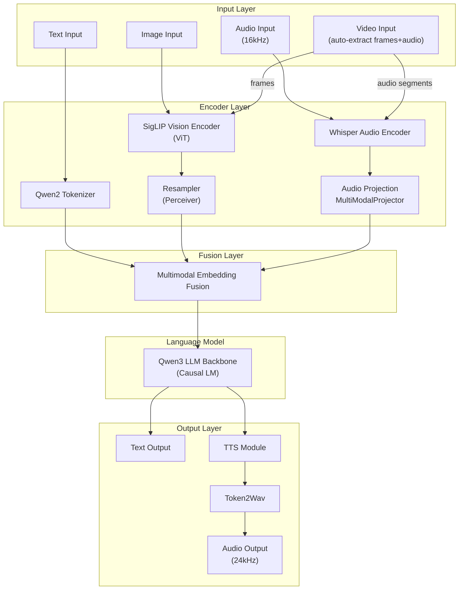
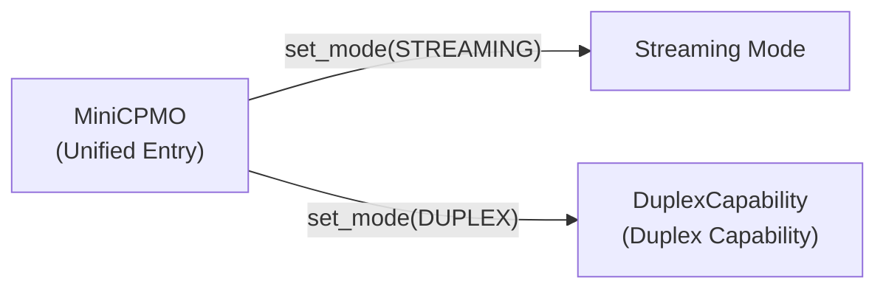

# MiniCPMO45 Model Module Details

MiniCPMO45 is the system's core model module, implementing multimodal large language model inference capabilities with support for text, image, audio, and video input, as well as text and audio output.

## Module Structure

```
MiniCPMO45/
├── configuration_minicpmo.py       # Model configuration definitions
├── modeling_minicpmo.py            # Main model implementation
├── modeling_minicpmo_unified.py    # Unified model (supports hot-switching)
├── modeling_navit_siglip.py        # SigLIP vision encoder
├── processing_minicpmo.py          # Multimodal processor
├── tokenization_minicpmo_fast.py   # Fast tokenizer
├── utils.py                        # Utility functions
├── tokenizer_config.json           # Tokenizer configuration
├── generation_config.json          # Generation configuration
├── preprocessor_config.json        # Preprocessor configuration
├── special_tokens_map.json         # Special token mapping
└── added_tokens.json               # Extended tokens
```

## Multimodal Architecture Overview



---

## configuration_minicpmo.py — Model Configuration

### MiniCPMOConfig

Inherits from `Qwen3Config` and defines the complete multimodal model configuration.

**Sub-configurations**:
- `vision_config: SiglipVisionConfig` — Vision encoder configuration
- `audio_config: WhisperConfig` — Audio encoder configuration
- `tts_config: MiniCPMTTSConfig` — TTS module configuration
- `slice_config: MiniCPMVSliceConfig` — Image slicing configuration

**Key parameters**:

| Parameter | Default | Description |
|-----------|---------|-------------|
| `query_num` | 64 | Number of Resampler queries |
| `image_size` | 448 | Default image size |
| `drop_vision_last_layer` | True | Drop the last layer of the vision encoder |
| `vision_batch_size` | 16 | Vision batch size |
| `audio_pool_step` | 5 | Audio feature pooling step |
| `audio_chunk_length` | 1.0 | Audio chunk length (seconds) |
| `init_vision` | True | Initialize vision encoder |
| `init_audio` | True | Initialize audio encoder |
| `init_tts` | True | Initialize TTS module |

### MiniCPMTTSConfig

TTS module-specific configuration.

| Parameter | Default | Description |
|-----------|---------|-------------|
| `llm_dim` | 2560 | LLM projection dimension |
| `hidden_size` | 768 | TTS hidden layer size |
| `num_hidden_layers` | 20 | Number of TTS layers |
| `num_attention_heads` | 12 | Number of TTS attention heads |
| `num_audio_tokens` | 4097 | Number of audio tokens |
| `num_text_tokens` | 21178 | Number of text tokens |
| `streaming` | True | Streaming mode |
| `attention_type` | `"sliding_recompute"` | Attention type |
| `window_size` | 2 | Sliding window size |

---

## modeling_navit_siglip.py — Vision Encoder

### SigLIP Vision Transformer

A **SigLIP**-based vision encoder for processing image input.

#### Architecture Components

| Component | Class | Description |
|-----------|-------|-------------|
| Embedding layer | `SiglipVisionEmbeddings` | Patch Embedding (Conv2d) + positional encoding |
| Encoder | `SiglipEncoder` | Multi-layer Transformer encoder |
| Attention | `SiglipAttention` | Multi-head self-attention (supports Flash Attention 2) |
| FFN | `SiglipMLP` | Feed-forward network |
| Post-processing | `post_layernorm` | Layer normalization |

#### Features

- Flash Attention 2 acceleration support
- Dynamic patch attention mask for handling different image sizes
- Batch processing of multi-size images via `tgt_sizes`

---

## modeling_minicpmo.py — Main Model Implementation

### MiniCPMO Class

Inherits from `MiniCPMOPreTrainedModel` (based on `Qwen3PreTrainedModel`) and implements complete multimodal inference.

#### Model Components

| Component | Type | Description |
|-----------|------|-------------|
| `llm` | `Qwen3ForCausalLM` | Language model backbone |
| `vpm` | `SiglipVisionTransformer` | Vision encoder |
| `resampler` | `Resampler` | Vision feature resampling (Perceiver architecture) |
| `apm` | `MiniCPMWhisperEncoder` | Audio encoder (Whisper) |
| `audio_projection_layer` | `MultiModalProjector` | Audio feature projection |
| `tts` | `MiniCPMTTS` | TTS generator |

#### Core Methods

**Vision processing**:
- `get_vision_embedding(pixel_values, tgt_sizes)` — Image encoding + Resampler mapping

**Audio processing**:
- `get_audio_embedding(audio_features, audio_feature_lens)` — Whisper encoding + AvgPool1d + projection

**Inference methods**:

| Method | Description |
|--------|-------------|
| `forward(input_ids, pixel_values, audio_features, ...)` | Forward pass (supports KV Cache) |
| `streaming_prefill(session_id, msgs, tokenizer, ...)` | Streaming prefill (supports KV Cache reuse) |
| `streaming_generate(session_id, tokenizer, ...)` | Streaming generation (Generator) |

### MiniCPMODuplex Class

A specialized duplex inference class that supports simultaneous listening and speaking.

#### Key Methods

| Method | Description |
|--------|-------------|
| `streaming_prefill(audio_features, frames, ...)` | Prefill audio chunks and video frames |
| `streaming_generate(...)` | Generate one step (decide listen or speak) |

#### Sliding Window Strategies

| Strategy | Description |
|----------|-------------|
| `basic` | Basic sliding window — retains the most recent N tokens |
| `context` | Context sliding window — retains system prompt + most recent N tokens |

### MiniCPMTTS Class

A TTS generator that converts LLM output text tokens into audio tokens.

#### Architecture

| Component | Description |
|-----------|-------------|
| `emb_text` | Text embedding layer |
| `emb_code` | Audio codebook embedding |
| `model` | LlamaModel backbone |
| `head_code` | Audio token prediction head |

#### Attention Modes

| Mode | Description |
|------|-------------|
| `full_attention` | Full attention (highest accuracy, highest memory) |
| `sliding_window` | Sliding window (balanced approach) |
| `sliding_recompute` | Sliding recompute (default, balances accuracy and efficiency) |
| `reindex` | RoPE reindexing (experimental) |

---

## modeling_minicpmo_unified.py — Unified Model

### Design Goals

The unified model merges Streaming and Duplex modes into a single model instance, enabling millisecond-level mode switching (< 0.1ms) and avoiding redundant model weight loading.

### MiniCPMO (Unified Version)

Inherits from the standard `MiniCPMO` and composes `DuplexCapability`.



#### Core Methods

| Method | Description |
|--------|-------------|
| `init_unified(preload_both_tts)` | Initialize unified model, preload dual TTS |
| `set_mode(mode)` | Switch mode (auto-switches TTS tokenizer, clears KV Cache) |
| `streaming_prefill(...)` / `streaming_generate(...)` | Streaming inference |
| `duplex_prepare(...)` / `duplex_prefill(...)` / `duplex_generate(...)` | Online duplex inference |

### DuplexCapability

A composition-based duplex capability component that does not inherit from the model but shares model parameters via reference.

#### Encapsulated Logic
- Duplex system prompt handling
- Audio/video prefill
- Listen/Speak decision generation
- Streaming decoding via `StreamDecoder`

---

## processing_minicpmo.py — Multimodal Processor

### MiniCPMOProcessor

A unified multimodal preprocessor that combines image, audio, and text processing.

#### Sub-processors

| Component | Class | Description |
|-----------|-------|-------------|
| Image | `MiniCPMVImageProcessor` | Image slicing, preprocessing, padding |
| Audio | `MiniCPMAAudioProcessor` | Mel spectrogram extraction |
| Text | `MiniCPMOTokenizerFast` | Tokenization |

#### MiniCPMVImageProcessor

| Method | Description |
|--------|-------------|
| `slice_image(image, max_slice_nums)` | Large image slicing (max 9 slices) |
| `get_sliced_grid(image_size, max_slice_nums)` | Compute optimal slicing grid |
| `preprocess(images, ...)` | Image preprocessing (normalization, resize) |

#### MiniCPMAAudioProcessor

Inherits from `WhisperFeatureExtractor` and extracts Mel spectrograms.

| Method | Description |
|--------|-------------|
| `__call__(audio, sampling_rate, ...)` | Extract audio features |
| `StreamingMelProcessorExact` | Exact streaming Mel processor |

#### Unified Entry Point

| Method | Description |
|--------|-------------|
| `__call__(text, images, audios, ...)` | Unified multimodal input processing |
| `process_image(images, ...)` | Image batch processing |
| `process_audio(audios, ...)` | Audio batch processing |
| `process_audio_streaming(audio_chunk, ...)` | Streaming audio processing |
| `_convert_omni_to_inputs(...)` | Omni mode input conversion |

---

## tokenization_minicpmo_fast.py — Fast Tokenizer

### MiniCPMOTokenizerFast

Inherits from `Qwen2TokenizerFast` with extended multimodal special tokens.

#### Special Tokens

| Category | Token | Description |
|----------|-------|-------------|
| Image | `<image>`, `</image>` | Image content boundaries |
| Image slice | `<slice>`, `</slice>` | Image slice boundaries |
| Audio | `<|audio_start|>`, `<|audio_end|>` | Audio content boundaries |
| TTS | `<|tts_bos|>`, `<|tts_eos|>` | TTS generation boundaries |
| Duplex | `<|listen|>`, `<|speak|>` | Duplex mode action markers |

These special tokens provide corresponding token IDs through property methods, used for conditional logic and generation control during model inference.

---

## utils.py — Utility Functions

### ChunkPrefillChunkGenerate

Chunked prefill and generator with support for:
- Repetition penalty
- Length penalty
- Forbidden token filtering
- Chunked prefill (reduces memory peaks)

### StreamDecoder

A streaming decoder that manages the token stream in duplex mode.

| Method | Description |
|--------|-------------|
| `enforce_window(max_len)` | Basic sliding window — truncates sequences exceeding max_len |
| `enforce_window_with_context(max_len, context_len)` | Context-preserving sliding window |
| `register_unit_start()` / `register_unit_end()` | Register generation unit boundaries |

### TTSStreamingGenerator

A streaming TTS generator that manages streaming inference for the TTS model.

Supports multiple attention modes:
- `full_attention` — Full attention
- `sliding_window` — Sliding window
- `sliding_recompute` — Sliding recompute (default)
- `reindex` — RoPE reindexing

### SpeculativeSnapshot

A VAD speculative snapshot tool for saving and restoring inference state (KV Cache, Mel processor state), supporting speculative pre-generation and rollback.
