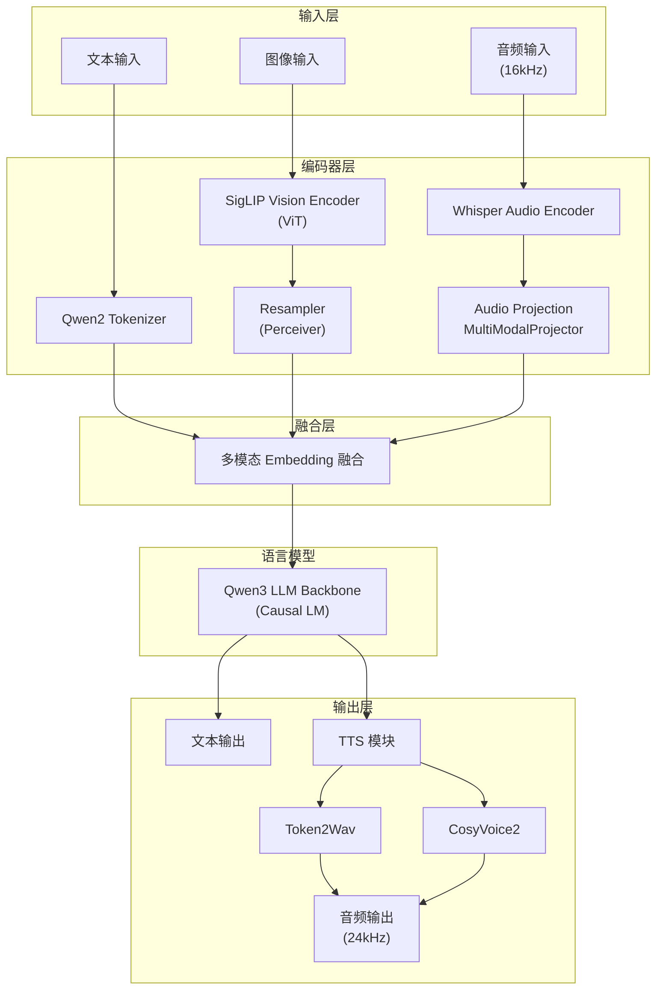
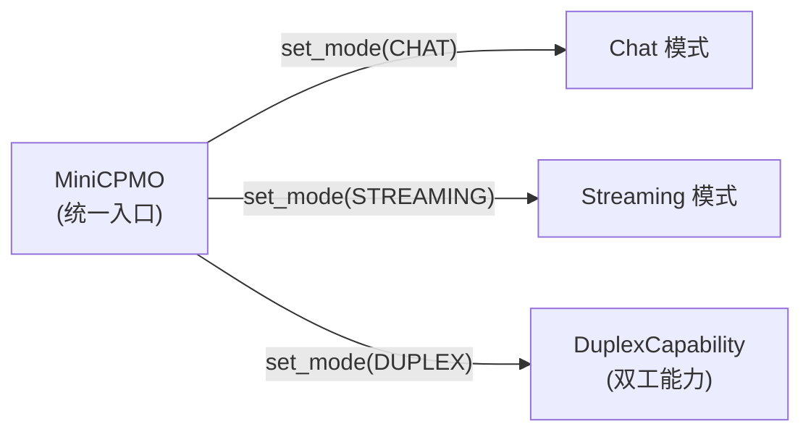

# MiniCPMO45 模型模块详解

MiniCPMO45 是系统的核心模型模块，实现了多模态大语言模型的推理能力，支持文本、图像、音频输入和文本、音频输出。

## 模块结构

```
MiniCPMO45/
├── configuration_minicpmo.py       # 模型配置定义
├── modeling_minicpmo.py            # 主模型实现
├── modeling_minicpmo_unified.py    # 统一模型（支持热切换）
├── modeling_navit_siglip.py        # SigLIP 视觉编码器
├── processing_minicpmo.py          # 多模态处理器
├── tokenization_minicpmo_fast.py   # 快速分词器
├── utils.py                        # 工具函数
├── tokenizer_config.json           # 分词器配置
├── generation_config.json          # 生成配置
├── preprocessor_config.json        # 预处理器配置
├── special_tokens_map.json         # 特殊 token 映射
└── added_tokens.json               # 扩展 token
```

## 多模态架构总览



---

## configuration_minicpmo.py — 模型配置

### MiniCPMOConfig

继承自 `Qwen3Config`，定义完整的多模态模型配置。

**子配置**：
- `vision_config: SiglipVisionConfig` — 视觉编码器配置
- `audio_config: WhisperConfig` — 音频编码器配置
- `tts_config: MiniCPMTTSConfig` — TTS 模块配置
- `slice_config: MiniCPMVSliceConfig` — 图像切片配置

**关键参数**：

| 参数 | 默认值 | 说明 |
|------|--------|------|
| `query_num` | 64 | Resampler 查询数量 |
| `image_size` | 448 | 默认图像尺寸 |
| `drop_vision_last_layer` | True | 丢弃视觉编码器最后一层 |
| `vision_batch_size` | 16 | 视觉批处理大小 |
| `audio_pool_step` | 5 | 音频特征池化步长 |
| `audio_chunk_length` | 1.0 | 音频块长度（秒） |
| `init_vision` | True | 初始化视觉编码器 |
| `init_audio` | True | 初始化音频编码器 |
| `init_tts` | True | 初始化 TTS 模块 |

### MiniCPMTTSConfig

TTS 模块专用配置。

| 参数 | 默认值 | 说明 |
|------|--------|------|
| `llm_dim` | 2560 | LLM 投影维度 |
| `hidden_size` | 768 | TTS 隐藏层大小 |
| `num_hidden_layers` | 20 | TTS 层数 |
| `num_attention_heads` | 12 | TTS 注意力头数 |
| `num_audio_tokens` | 4097 | 音频 token 数量 |
| `num_text_tokens` | 21178 | 文本 token 数量 |
| `streaming` | True | 流式模式 |
| `attention_type` | `"sliding_recompute"` | 注意力类型 |
| `window_size` | 2 | 滑动窗口大小 |

---

## modeling_navit_siglip.py — 视觉编码器

### SigLIP Vision Transformer

基于 **SigLIP** 的视觉编码器，处理图像输入。

#### 架构组件

| 组件 | 类 | 说明 |
|------|-----|------|
| 嵌入层 | `SiglipVisionEmbeddings` | Patch Embedding (Conv2d) + 位置编码 |
| 编码器 | `SiglipEncoder` | 多层 Transformer 编码器 |
| 注意力 | `SiglipAttention` | 多头自注意力（支持 Flash Attention 2） |
| FFN | `SiglipMLP` | 前馈网络 |
| 后处理 | `post_layernorm` | 层归一化 |

#### 特性

- 支持 Flash Attention 2 加速
- 动态 patch attention mask 处理不同尺寸图像
- 支持 `tgt_sizes` 批量处理多尺寸图像

---

## modeling_minicpmo.py — 主模型实现

### MiniCPMO 类

继承自 `MiniCPMOPreTrainedModel`（基于 `Qwen3PreTrainedModel`），实现完整的多模态推理。

#### 模型组件

| 组件 | 类型 | 说明 |
|------|------|------|
| `llm` | `Qwen3ForCausalLM` | 语言模型 backbone |
| `vpm` | `SiglipVisionTransformer` | 视觉编码器 |
| `resampler` | `Resampler` | 视觉特征重采样（Perceiver 架构） |
| `apm` | `MiniCPMWhisperEncoder` | 音频编码器（Whisper） |
| `audio_projection_layer` | `MultiModalProjector` | 音频特征投影 |
| `tts` | `MiniCPMTTS` | TTS 生成器 |

#### 核心方法

**视觉处理**：
- `get_vision_embedding(pixel_values, tgt_sizes)` — 图像编码 + Resampler 映射

**音频处理**：
- `get_audio_embedding(audio_features, audio_feature_lens)` — Whisper 编码 + AvgPool1d + 投影

**推理方法**：

| 方法 | 说明 |
|------|------|
| `forward(input_ids, pixel_values, audio_features, ...)` | 前向传播（支持 KV Cache） |
| `chat(msgs, tokenizer, ...)` | 离线对话（文本/图像/音频输入，可选 TTS 输出） |
| `streaming_prefill(session_id, msgs, tokenizer, ...)` | 流式预填充（支持 KV Cache 复用） |
| `streaming_generate(session_id, tokenizer, ...)` | 流式生成（Generator） |

### MiniCPMODuplex 类

专门的双工推理类，支持边听边说。

#### 关键方法

| 方法 | 说明 |
|------|------|
| `streaming_prefill(audio_features, frames, ...)` | 预填充音频块和视频帧 |
| `streaming_generate(...)` | 生成一步（决定 listen 或 speak） |

#### 滑动窗口策略

| 策略 | 说明 |
|------|------|
| `basic` | 基础滑动窗口 — 保留最近 N 个 token |
| `context` | 上下文滑动窗口 — 保留系统提示词 + 最近 N 个 token |

### MiniCPMTTS 类

TTS 生成器，将 LLM 输出的文本 token 转换为音频 token。

#### 架构

| 组件 | 说明 |
|------|------|
| `emb_text` | 文本嵌入层 |
| `emb_code` | 音频 codebook 嵌入 |
| `model` | LlamaModel backbone |
| `head_code` | 音频 token 预测头 |

#### 注意力模式

| 模式 | 说明 |
|------|------|
| `full_attention` | 全注意力（精度最高，内存最大） |
| `sliding_window` | 滑动窗口（平衡方案） |
| `sliding_recompute` | 滑动重计算（默认，平衡精度与效率） |
| `reindex` | RoPE 重索引（实验性） |

---

## modeling_minicpmo_unified.py — 统一模型

### 设计目标

统一模型将 Chat、Streaming、Duplex 三种模式合并到同一个模型实例中，实现毫秒级模式切换（< 0.1ms），避免重复加载模型权重。

### MiniCPMO（统一版）

继承标准 `MiniCPMO`，组合 `DuplexCapability`。



#### 核心方法

| 方法 | 说明 |
|------|------|
| `init_unified(preload_both_tts)` | 初始化统一模型，预加载双 TTS |
| `set_mode(mode)` | 切换模式（自动切换 TTS tokenizer，清理 KV Cache） |
| `chat(msgs, ...)` | Chat 推理 |
| `streaming_prefill(...)` / `streaming_generate(...)` | Streaming 推理 |
| `duplex_chat(...)` | 离线双工推理 |
| `duplex_prepare(...)` / `duplex_prefill(...)` / `duplex_generate(...)` | 在线双工推理 |

### DuplexCapability

组合模式的双工能力组件，不继承模型，通过引用共享模型参数。

#### 封装逻辑
- 双工 system prompt 处理
- 音频/视频预填充
- Listen/Speak 决策生成
- 使用 `StreamDecoder` 进行流式解码

---

## processing_minicpmo.py — 多模态处理器

### MiniCPMOProcessor

统一的多模态预处理器，组合图像、音频和文本处理。

#### 子处理器

| 组件 | 类 | 说明 |
|------|-----|------|
| 图像 | `MiniCPMVImageProcessor` | 图像切片、预处理、padding |
| 音频 | `MiniCPMAAudioProcessor` | Mel spectrogram 提取 |
| 文本 | `MiniCPMOTokenizerFast` | 分词 |

#### MiniCPMVImageProcessor

| 方法 | 说明 |
|------|------|
| `slice_image(image, max_slice_nums)` | 大图切片（最大 9 片） |
| `get_sliced_grid(image_size, max_slice_nums)` | 计算最优切片网格 |
| `preprocess(images, ...)` | 图像预处理（归一化、resize） |

#### MiniCPMAAudioProcessor

继承 `WhisperFeatureExtractor`，提取 Mel spectrogram。

| 方法 | 说明 |
|------|------|
| `__call__(audio, sampling_rate, ...)` | 提取音频特征 |
| `StreamingMelProcessorExact` | 精确流式 Mel 处理器 |

#### 统一入口

| 方法 | 说明 |
|------|------|
| `__call__(text, images, audios, ...)` | 统一处理多模态输入 |
| `process_image(images, ...)` | 图像批处理 |
| `process_audio(audios, ...)` | 音频批处理 |
| `process_audio_streaming(audio_chunk, ...)` | 流式音频处理 |
| `_convert_omni_to_inputs(...)` | Omni 模式输入转换 |

---

## tokenization_minicpmo_fast.py — 快速分词器

### MiniCPMOTokenizerFast

继承 `Qwen2TokenizerFast`，扩展多模态特殊 token。

#### 特殊 Token

| 类别 | Token | 说明 |
|------|-------|------|
| 图像 | `<image>`, `</image>` | 图像内容边界 |
| 图像切片 | `<slice>`, `</slice>` | 图像切片边界 |
| 音频 | `<|audio_start|>`, `<|audio_end|>` | 音频内容边界 |
| TTS | `<|tts_bos|>`, `<|tts_eos|>` | TTS 生成边界 |
| 双工 | `<|listen|>`, `<|speak|>` | 双工模式动作标记 |

这些特殊 token 通过属性方法提供对应的 token ID，用于模型推理中的条件判断和生成控制。

---

## utils.py — 工具函数

### ChunkPrefillChunkGenerate

分块预填充和生成器，支持：
- 重复惩罚（repetition penalty）
- 长度惩罚（length penalty）
- 禁止 token 过滤
- 分块 prefill（减少内存峰值）

### StreamDecoder

流式解码器，管理双工模式的 token 流。

| 方法 | 说明 |
|------|------|
| `enforce_window(max_len)` | 基础滑动窗口 — 截断超过 max_len 的序列 |
| `enforce_window_with_context(max_len, context_len)` | 上下文保留滑动窗口 |
| `register_unit_start()` / `register_unit_end()` | 注册生成单元的边界 |

### TTSStreamingGenerator

流式 TTS 生成器，管理 TTS 模型的流式推理。

支持多种注意力模式：
- `full_attention` — 全注意力
- `sliding_window` — 滑动窗口
- `sliding_recompute` — 滑动重计算（默认）
- `reindex` — RoPE 重索引

### SpeculativeSnapshot

VAD 抢跑快照工具，用于保存和恢复推理状态（KV Cache、Mel 处理器状态），支持投机性预生成和回滚。
