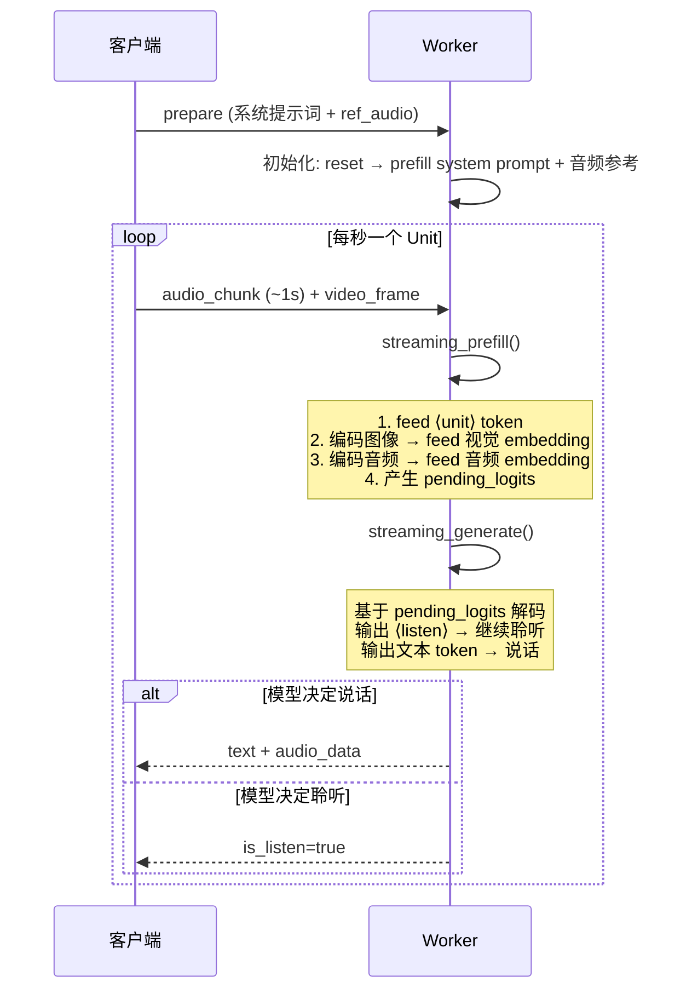
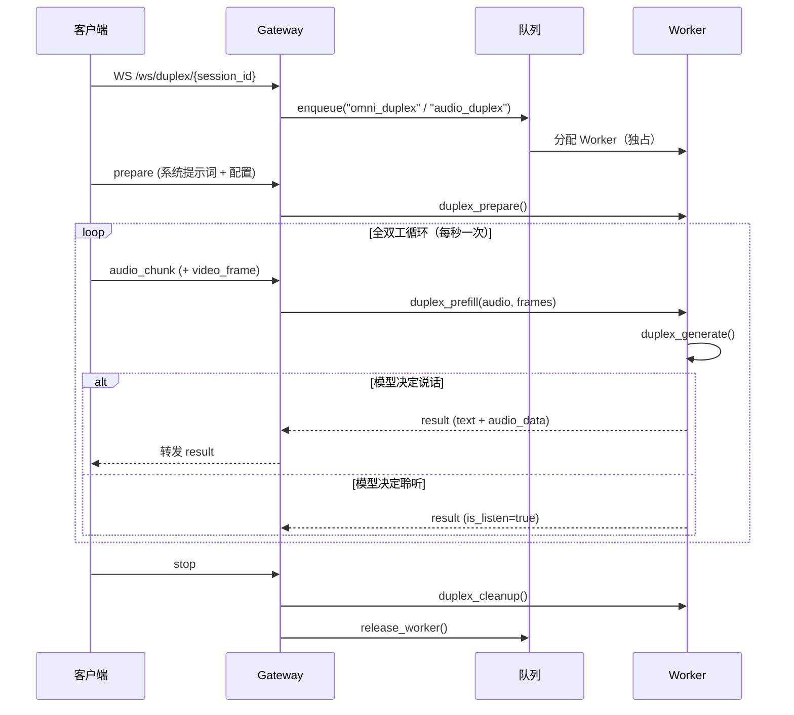

# Duplex 模式详解

Duplex 接口（`/ws/duplex/{session_id}`）支持两种全双工交互模式：

- **Omnimodal Full-Duplex**：每秒发送 `audio_chunk` + `video_frame`，模型同时处理视觉和语音
- **Audio Full-Duplex**：每秒仅发送 `audio_chunk`，无视觉输入

两者共享相同的 prefill-generate unit 循环，区别仅在于是否传入视频帧。

## 基础概念

Duplex（全双工）模式实现了类似电话的实时对话体验：用户说话的同时，模型可以随时开口回应，无需等待用户说完。

与其他模式的关键区别：

| | Chat 模式 | Half-Duplex 模式 | Duplex 模式 |
|---|---|---|---|
| 交互方式 | 轮次式（手动触发） | 轮次式（VAD 自动触发） | 实时全双工（同时收听和回应） |
| 输入处理 | 一次性 prefill 完整消息 | VAD 检测语音段 → prefill | 每秒流式 prefill 音频/视频 |
| Worker 占用 | 仅推理期间，完成即释放 | 整个会话期间独占 | 整个会话期间独占 |
| 适用场景 | 文本/多模态问答 | 语音对话、免手操作 | 语音/视频实时对话 |

## 每秒一次的 Unit 循环

Duplex 的核心是一个 **每秒执行一次** 的 prefill-generate 循环，每次循环称为一个 "unit"：



`streaming_prefill()` 每秒接收一段音频（和可选的视频帧），编码后 feed 进 LLM 的 KV Cache：

```python
# MiniCPMO45/modeling_minicpmo_unified.py — DuplexCapability.streaming_prefill()
# 每秒调用一次，根据输入确定模式: AUDIO / VISION / OMNI

# Step 1: feed <unit> token（标记新 unit 开始）
self.decoder.feed(self.decoder.embed_token(self.unit_token_id))

# Step 2: 编码图像 → feed 视觉 embedding（如有视频帧）
vision_hidden_states = self.model.get_vision_embedding(processed_frames)
self.decoder.feed(vision_embed)

# Step 3: 编码音频 → feed 音频 embedding
audio_embeds = self.model.get_audio_embedding(processed_audio)
self.decoder.feed(audio_embed)
# → 产生 pending_logits，供 generate 使用
```

`streaming_generate()` 基于 `pending_logits` 解码，模型自主决定是"聆听"还是"说话"：

```python
# MiniCPMO45/modeling_minicpmo_unified.py — DuplexCapability.streaming_generate()
logits = self.pending_logits
for j in range(max_new_speak_tokens_per_chunk):
    last_id = self.decoder.decode(logits=logits, mode=decode_mode, ...)

    is_listen = last_id.item() == self.listen_token_id
    if last_id.item() in self.chunk_terminator_token_ids:
        break  # 本 chunk 结束（listen / chunk_eos / turn_eos）
    else:
        self.res_ids.append(last_id.item())  # 记录说话 token
        self.speak_count += 1
        logits, hidden = self.decoder.feed(...)  # feed token, 获取下一步 logits
```

## 完整流程（含排队 + Gateway 代理）



## Omnimodal vs Audio 模式

Gateway 在入队时通过 `task_type` 区分两种模式：

| | Omnimodal Full-Duplex | Audio Full-Duplex |
|---|---|---|
| 入队 task_type | `omni_duplex` | `audio_duplex` |
| 前端页面 | `omni.html` | `audio_duplex.html` |
| 每秒发送 | `audio_chunk` + `video_frame` | `audio_chunk` |
| `streaming_prefill()` 模式 | OMNI（音频 + 视觉） | AUDIO（仅音频） |
| 视觉编码 | SigLIP → Resampler → feed | 跳过 |

两种模式在 Worker 侧共享完全相同的代码路径，`DuplexCapability.streaming_prefill()` 根据是否传入 `frame_list` 自动选择模式（AUDIO / VISION / OMNI）。

## Worker 侧处理细节

Duplex 是最复杂的独占模式，Worker 在整个会话期间被独占。

### prepare 阶段

1. 设置状态 → `DUPLEX_ACTIVE`（独占 Worker）
2. 解码 LLM ref_audio 和 TTS ref_audio（两者可以不同）：
   - LLM ref_audio → 嵌入 system prompt
   - TTS ref_audio → 初始化 vocoder
3. `duplex_prepare(system_prompt, ref_audio, tts_audio)` 初始化双工会话
4. 初始化 `DuplexSessionRecorder`（可选）
5. 发送 `prepared`

### 全双工循环

每轮循环处理一个音频 chunk（约 1 秒）：

1. 解码 `audio_base64` → float32 音频波形（16kHz）
2. 解码 `frame_base64_list` → PIL Image 列表（仅 Omni 模式）
3. 等待上一轮 finalize 完成（`asyncio.Event` 栅栏）
4. 在线程中执行：
   - `duplex_prefill(audio, frames)` — 预填充音频 + 视频
   - `duplex_generate(force_listen)` — 模型决定 listen 或 speak
5. 发送 `result`（含 `is_listen`, `text`, `audio_data`, 性能指标, `kv_cache_length`）
6. **Deferred Finalize**（默认开启）：
   - 先发送结果给客户端（overlap 网络传输）
   - 异步执行 `duplex_finalize()`（约 37ms，feed 终止符 + 滑窗维护）
   - 通过 `asyncio.Event` 栅栏保证在下轮 prefill 前完成
   - 实测：LISTEN wall_clock 降低约 30ms，SPEAK 降低约 50ms

### 暂停与恢复

- `pause` → `DUPLEX_PAUSED` + 启动超时看门狗
- `resume` → `DUPLEX_ACTIVE` + 取消看门狗
- 超时（默认 60s）→ 自动释放 Worker，通知客户端

### 停止与资源清理

- `stop` → `duplex_stop()`
- `finally` 块（无论正常/异常结束）：
  - `duplex_stop()` 停止生成
  - `duplex_cleanup()` 释放 GPU 资源：
    - 释放 KV Cache、TTS caches 等
    - `gc.collect()` + `torch.cuda.empty_cache()`
    - 释放约 1.5GB 显存（诊断数据：stop 后泄漏 ~1,591 MB → cleanup 后残留 ~48 MB）
  - 状态恢复 → `IDLE`
