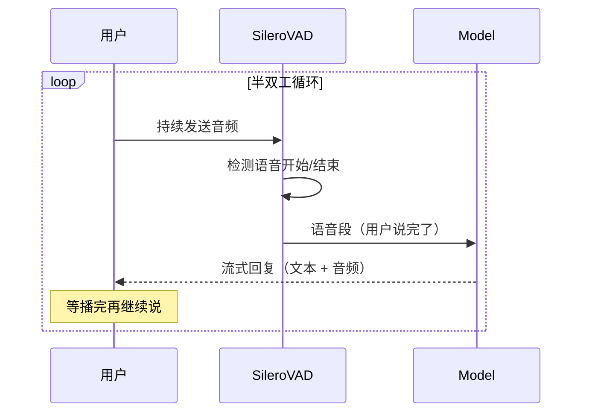
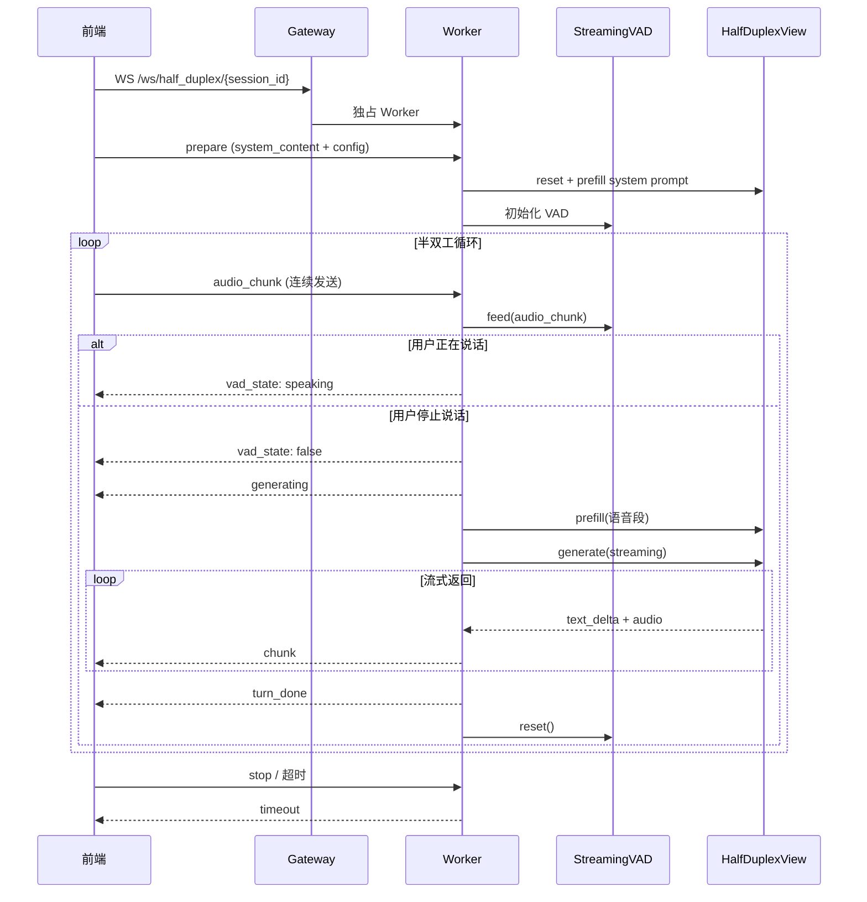

# Half-Duplex Audio 模式详解

Half-Duplex Audio 页面的核心推理模式。通过 `/ws/half_duplex/{session_id}` WebSocket 接口，实现基于 VAD 的半双工语音通话。

## 一句话理解

> 用户说话时 VAD 自动检测语音边界，说完后将语音段喂给模型生成回复，等回复播完再继续听 —— 像打电话一样的轮流说话。

## 与其他模式对比

| | Chat 模式 | Half-Duplex 模式 | Duplex 模式 |
|---|---|---|---|
| 交互方式 | 轮次式（手动触发） | 轮次式（VAD 自动触发） | 全双工（同时收听和回应） |
| 输入处理 | 一次性 prefill 完整消息 | VAD 检测语音段 → prefill | 每秒流式 prefill 音频/视频 |
| Worker 占用 | 仅推理期间，完成即释放 | 整个会话期间独占（默认 3 分钟） | 整个会话期间独占 |
| 语音检测 | 无（前端手动录制） | 服务端 SileroVAD | 无（模型自主判断） |
| 适用场景 | 文本/多模态问答 | 语音对话、免手操作 | 实时语音/视频对话 |

## 整体流程

### 简化视角



### 详细视角



## VAD 阶段

Half-Duplex 的核心是服务端 VAD（Voice Activity Detection），使用 SileroVAD ONNX 模型实时检测用户语音。

### StreamingVAD

`vad/vad.py` 中的 `StreamingVAD` 类封装了流式 VAD 逻辑：

```python
vad = StreamingVAD(options=StreamingVadOptions(
    threshold=0.8,              # 语音概率阈值
    min_speech_duration_ms=128, # 最小语音段长度
    min_silence_duration_ms=800,# 最小静音长度（判定说完）
    speech_pad_ms=30,           # 语音段两侧填充
))

# 逐 chunk 喂入
for audio_chunk in audio_stream:
    speech_segment = vad.feed(audio_chunk)  # float32, 16kHz
    if speech_segment is not None:
        # 用户说完了，speech_segment 是完整的语音 ndarray
        model.prefill(speech_segment)
        model.generate()
```

### 工作原理

1. 前端每 0.5 秒发送一个 `audio_chunk`（16kHz float32 PCM）
2. `StreamingVAD.feed()` 按 1024 sample 窗口滑动，每个窗口调用 SileroVAD 计算语音概率
3. 概率 >= threshold → 标记"说话开始"，累积音频到 buffer
4. 概率 < (threshold - 0.15) 且持续 >= min_silence_duration_ms → 判定"说完"
5. 返回累积的语音段，VAD 状态 reset

### 防误触机制

- **冷启动保护**：`prepare` 后 0.5 秒内忽略所有 VAD，避免麦克风初始化噪声误触发
- **AI 播放期间静默**：前端在 AI 音频播放期间不发送 `audio_chunk`，避免自激回声
- **播完恢复延迟**：`turn_done` 后等 AI 音频播完 + 800ms 缓冲才恢复发送

## Prefill + Generate 阶段

VAD 检测到语音段后，使用 `HalfDuplexView` 进行推理。HalfDuplexView 复用了模型的 `streaming_prefill` + `streaming_generate` 能力：

1. 语音段 → Base64 编码 → `AudioContent` → `Message(role=USER)`
2. `HalfDuplexView.prefill(request)` — 将用户语音 prefill 到 KV Cache
3. `HalfDuplexView.generate()` — 流式生成文本 + 音频 chunk
4. 每个 chunk 通过 WebSocket 发送给前端

KV Cache 在整个会话期间保持，支持多轮上下文累积。

## WebSocket 协议

### 端点

```
wss://host/ws/half_duplex/{session_id}
```

Gateway 将此连接代理到 Worker，Worker 在整个会话期间被独占。

### 客户端 → 服务端

| 类型 | 字段 | 说明 |
|------|------|------|
| `prepare` | `system_content`, `config` | 初始化会话（system_content 格式与 turn-based 相同） |
| `audio_chunk` | `audio_base64` | 发送麦克风音频（float32 PCM 16kHz） |
| `stop` | — | 停止会话 |

`config` 结构：

```json
{
  "vad": {"threshold": 0.8, "min_speech_duration_ms": 128, "min_silence_duration_ms": 800, "speech_pad_ms": 30},
  "generation": {"max_new_tokens": 256, "length_penalty": 1.1, "temperature": 0.7},
  "tts": {"enabled": true},
  "session": {"timeout_s": 180}
}
```

### 服务端 → 客户端

| 类型 | 字段 | 说明 |
|------|------|------|
| `queued` | `position`, `estimated_wait_s` | 排队中 |
| `queue_done` | — | 离开队列 |
| `prepared` | `session_id`, `timeout_s`, `recording_session_id` | 准备完成 |
| `vad_state` | `speaking` | VAD 状态变化（用户开始/停止说话） |
| `generating` | `speech_duration_ms` | 开始生成回复 |
| `chunk` | `text_delta`, `audio_data` | 流式生成的一个 chunk |
| `turn_done` | `turn_index`, `text` | 一轮生成完成 |
| `timeout` | `elapsed_s` | 会话超时 |
| `error` | `error` | 错误信息 |

## 调用链路

```
前端 half_duplex.html
  └─ WebSocket /ws/half_duplex/{session_id}
      └─ Gateway（独占 WS 代理）
          └─ Worker /ws/half_duplex
              ├─ prepare
              │   ├─ StreamingVAD 初始化
              │   ├─ HalfDuplexView.prefill(system_prompt)
              │   ├─ TTS init (ref_audio)
              │   └─ TurnBasedSessionRecorder 初始化
              └─ audio_chunk 循环
                  ├─ StreamingVAD.feed(chunk)
                  ├─ 语音段检测 → HalfDuplexView.prefill(user_audio)
                  ├─ HalfDuplexView.generate() → 流式 chunk
                  └─ VAD reset + 等待下一轮
```

## 前端参数透传

前端 Settings 面板中的参数通过 `prepare` 消息的 `config` 字段传到后端。参数保存在 `localStorage`，仅在 session 启动时发送，会话中修改不生效。

| 分类 | 参数 | 默认值 | 说明 |
|------|------|--------|------|
| VAD | threshold | 0.8 | 语音检测阈值（越高越严格） |
| VAD | min_speech_duration_ms | 128 | 最小语音段长度 |
| VAD | min_silence_duration_ms | 800 | 静音多久判定说完 |
| VAD | speech_pad_ms | 30 | 语音段两侧填充 |
| 生成 | max_new_tokens | 256 | 最大生成 token 数 |
| 生成 | length_penalty | 1.1 | 长度惩罚系数 |
| 生成 | temperature | 0.7 | 采样温度 |
| TTS | enabled | true | 是否生成语音回复 |
| 会话 | timeout_s | 180 | 会话超时时间（秒） |
