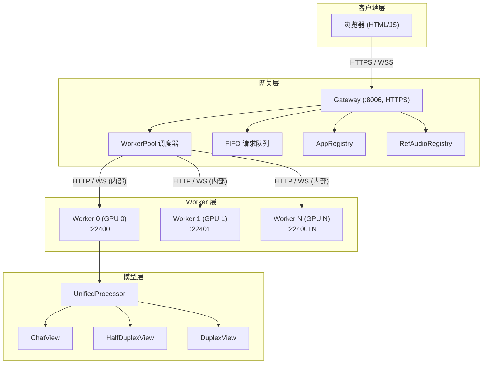
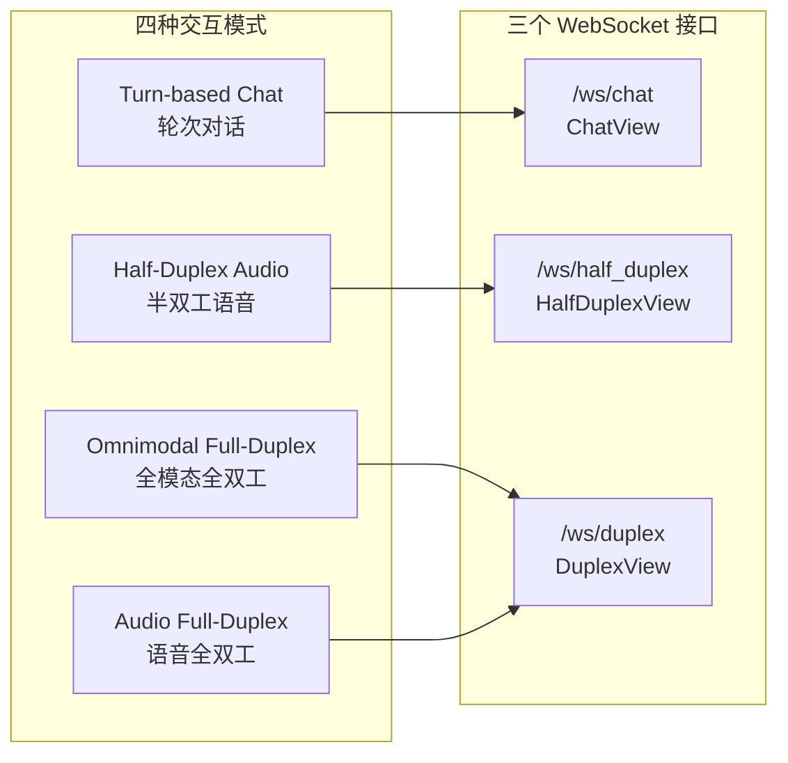

# 系统架构概述

## 整体架构

系统采用 **Frontend - Gateway - Worker Pool** 三层架构：

### 各层职责

| 层 | 组件 | 职责 |
|----|------|------|
| **客户端层** | 浏览器前端 | 模式选择、音视频采集、WebSocket 通信、会话录制 |
| **网关层** | Gateway | 请求路由分发、WebSocket 代理、FIFO 排队、会话亲和、ETA 估算 |
| **Worker 层** | Worker x N | 每 Worker 独占一张 GPU，执行模型推理，管理 KV Cache |
| **模型层** | UnifiedProcessor | 统一模型加载，Chat / Half-Duplex / Duplex 毫秒级热切换 |

## 三种交互模式

系统提供三种交互模式，底层共用 **两个 WebSocket 接口**：

| 模式 | 特点 | 输入模态 | 输出模态 | 交互范式 | 对应接口 |
|------|------|---------|---------|---------|---------|
| **Turn-based Chat** | 低延迟流式交互，按钮或 VAD 触发回复，基础能力强 | 音频 + 文本 + 图像 + 视频 | 音频 + 文本 | 轮次对话 | ChatView |
| **Half-Duplex Audio** | VAD 自动检测语音边界，免手操作的语音通话 | 语音 | 文本 + 语音 | 半双工 | HalfDuplexView |
| **Omnimodal Full-Duplex** | 全模态全双工，视觉 + 语音输入与语音输出同时进行 | 视觉 + 语音 | 文本 + 语音 | 全双工 | DuplexView |
| **Audio Full-Duplex** | 语音全双工，语音输入和输出同时进行 | 语音 | 文本 + 语音 | 全双工 | DuplexView |

### Chat 接口 — Turn-based Chat

Turn-based Chat 通过 **ChatView**（`/ws/chat` WebSocket）实现轮次式多模态对话。

ChatView 将推理分为 prefill 和 generate 两个阶段：prefill 一次性将所有消息填充到 KV Cache，generate 支持流式和非流式两种模式。前端可通过 Streaming 开关选择实时逐字输出或一次性返回。

详见 [ChatView 模式详解](chat.html)。

### Half-Duplex 接口 — Half-Duplex Audio

Half-Duplex Audio 通过 **HalfDuplexView**（`/ws/half_duplex/{session_id}` WebSocket）实现基于 VAD 的半双工语音通话。

服务端 SileroVAD 实时检测用户语音边界，说完后自动触发 prefill + streaming generate。Worker 在整个会话期间被独占（默认 3 分钟超时）。前端参数（VAD 阈值、生成参数等）在 session 启动时透传。

详见 [Half-Duplex 模式详解](half-duplex.html)。

### Duplex 接口 — Full-Duplex

Omnimodal Full-Duplex 和 Audio Full-Duplex 共用 **Duplex 接口** (`/ws/duplex/{session_id}`)，区别仅在于是否传入视频帧：

- **Omnimodal Full-Duplex**：每秒发送 `audio_chunk` + `video_frame`，模型同时处理视觉和语音
- **Audio Full-Duplex**：每秒仅发送 `audio_chunk`，无视觉输入

两者共享相同的 prefill-generate unit 循环，Worker 在整个会话期间被独占。

详见 [Duplex 模式详解](duplex.html)。
