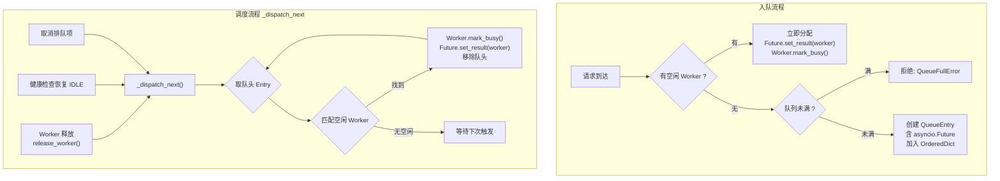
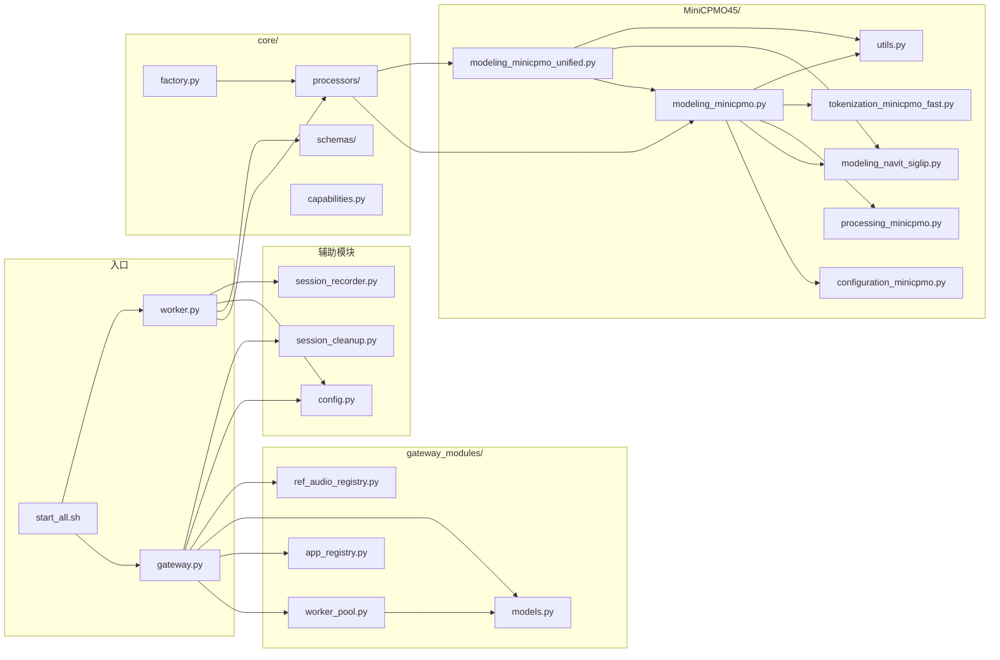
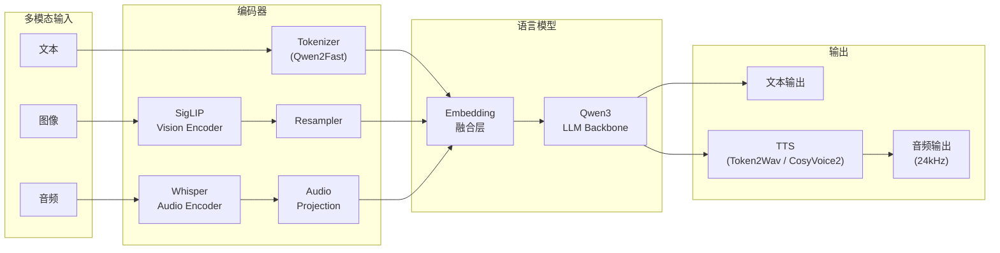
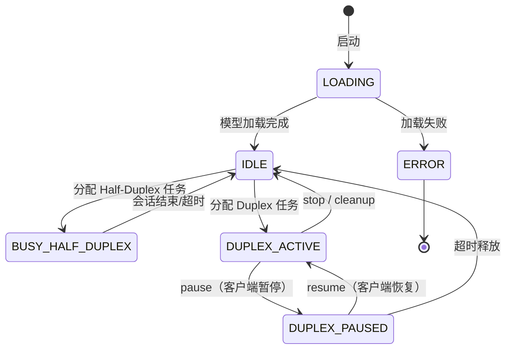
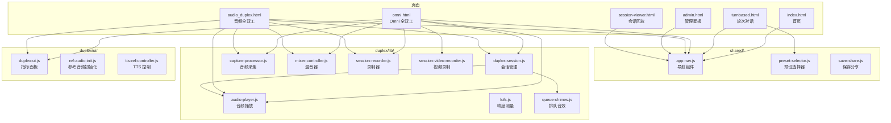

# 内部机制

## Worker 启动与模型加载

Worker 基于 **FastAPI** 构建，每个 Worker 独占一张 GPU，通过独立端口提供 HTTP 和 WebSocket 服务。

启动时在 `lifespan()` 异步上下文中调用 `load_model()`（同步操作，约 15s），通过 `asyncio.to_thread()` 避免阻塞事件循环。加载完成后：

1. 创建 `UnifiedProcessor` 实例（加载模型权重 + TTS）
2. `gc.collect()` + `torch.cuda.empty_cache()` 清理加载残留
3. 打印 Device Map（确认所有组件在 GPU 上）
4. 状态从 `LOADING` → `IDLE`

## FIFO 队列与 Worker 通信机制

队列在 Gateway 侧的 `WorkerPool` 中实现，使用 `OrderedDict` 保证 FIFO 顺序。核心通信机制如下：



**关键设计**：

1. **asyncio.Future 桥接**：每个排队请求持有一个 `asyncio.Future`，Gateway 的 WebSocket handler 通过 `await future` 阻塞等待分配结果。Worker 空闲时 `_dispatch_next()` 调用 `future.set_result(worker)` 唤醒等待者。
2. **单一调度点**：所有 Worker 分配都通过 `_dispatch_next()` 进行，在 Worker 释放、排队取消、健康检查恢复后触发，消除并发竞争。
3. **立即标记忙碌**：分配 Worker 时立即调用 `mark_busy()` 将状态改为忙碌，防止同一 Worker 被重复分配给多个请求。
4. **Gateway → Worker 通信**：Gateway 通过 WebSocket（Streaming/Duplex）直连 Worker 的内部端口（22400+），不经过队列。队列只负责 Worker 分配，不参与数据传输。

## 模块依赖拓扑



## 模型推理管线



## Worker 状态机



## 前端组件拓扑



## 会话录制

`session_recorder.py` 自动录制所有推理会话的输入输出数据，支持后续回放和分析。

### 会话目录结构

```
data/sessions/{session_id}/
├── meta.json                # 会话元数据（类型、创建时间、配置）
├── recording.json           # Timeline 录制数据
├── user_audio/              # 用户音频 chunks (WAV)
├── user_frames/             # 用户视频帧 (JPEG，仅 Omni)
├── ai_audio/                # AI 生成音频 (WAV)
├── user_images/             # 用户上传图片 (PNG)
├── merged_replay.wav        # 合并回放音频（Duplex）
└── merged_replay.mp4        # 合并回放视频（Omni）
```

录制器使用 `ThreadPoolExecutor`（4 线程）异步写入文件，不阻塞推理。

| 录制器 | 用途 |
|--------|------|
| `DuplexSessionRecorder` | Duplex 会话，记录每个 chunk 的 timeline 数据 |
| `TurnBasedSessionRecorder` | Turn-based 会话，累积 streaming chunk |

## 会话清理

`session_cleanup.py` 定期清理过期会话数据。

### 清理策略

1. **按时间** — 删除超过 `retention_days` 的会话
2. **按容量** — 超过 `max_storage_gb` 时按 LRU 删除

### 运行方式

- **自动**：Gateway 后台任务，每 24 小时执行
- **手动**：`python session_cleanup.py --data-dir data --retention-days 30 --max-storage-gb 50`
