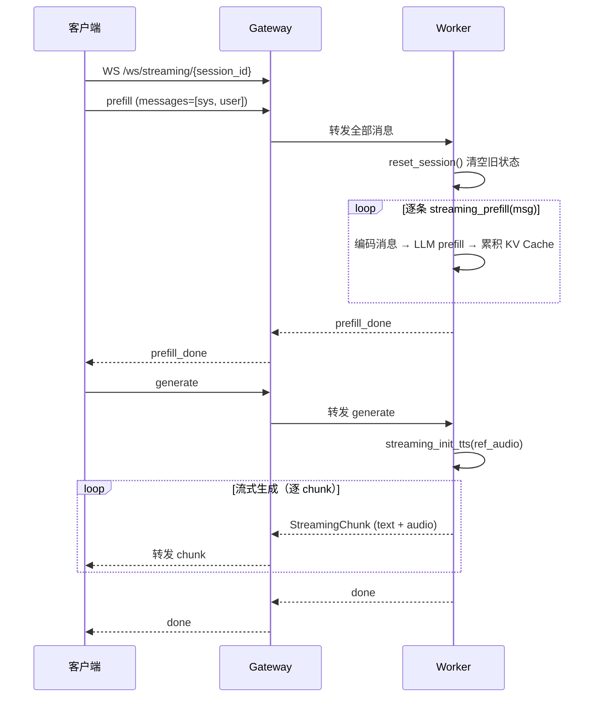
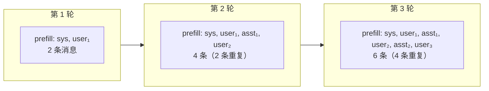
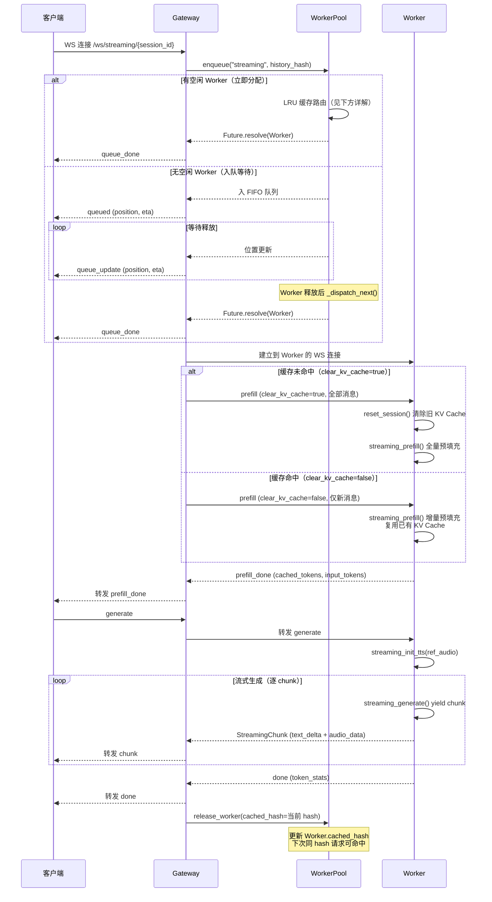
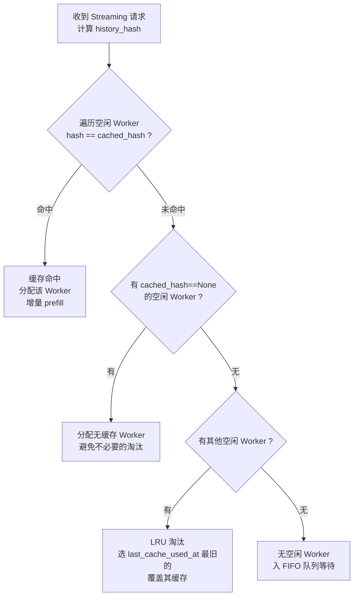

# Streaming 模式详解

Streaming 模式（`/ws/streaming/{session_id}`）实现 **Turn-based Chat**：用户发送完整消息后，模型流式返回文本 + 音频。核心优化是 **KV Cache 跨轮复用**。

## 基础流程

先看最简单的单轮 Streaming 流程——不涉及排队和缓存优化，只关注核心推理链路：



Worker 收到消息列表后，`StreamingView.prefill()` 将其拆分为逐条调用模型的 `streaming_prefill()`：

```python
# core/processors/unified.py — StreamingView.prefill()
def prefill(self, request: StreamingRequest) -> str:
    prompt = ""
    for i, msg in enumerate(request.messages):
        content = self._convert_content_to_model_format(msg.content)
        msgs = [{"role": msg.role.value, "content": content}]
        is_last = request.is_last_chunk and (i == len(request.messages) - 1)
        result = self._model.streaming_prefill(
            session_id=request.session_id, msgs=msgs,
            is_last_chunk=is_last, stream_input=False, ...
        )
        if result:
            prompt = result
    return prompt
```

每次 `streaming_prefill()` 执行后，模型将新的 KV 对累积到 `llm_past_key_values` 中，供后续生成使用：

```python
# MiniCPMO45/modeling_minicpmo_unified.py — streaming_prefill()
cache_length = self._get_kv_cache_length()
attention_mask = torch.ones((1, cache_length + inputs_embeds.shape[1]), ...)

outputs = self.llm(
    past_key_values=self.llm_past_key_values,  # 传入已有 KV Cache
    inputs_embeds=inputs_embeds,                # 仅当前消息的 embedding
    attention_mask=attention_mask,
    use_cache=True,
)
self.llm_past_key_values = as_dynamic_cache(outputs["past_key_values"])  # 更新缓存
```

## 为什么需要 KV Cache 复用？

上面的基础流程有一个问题：**每轮请求都需要从头 prefill 全部历史消息**。



随着对话轮次增加，重复计算量线性增长。对于包含图像和音频的多模态消息，重复 prefill 的代价尤其高昂。

**KV Cache 复用的核心思路**：Worker 推理完成后 **不清除** `llm_past_key_values`。当下一轮请求被路由到同一个 Worker 时，直接复用已有缓存，仅对新增消息做增量 prefill。

## KV Cache 复用的实现

复用机制分布在 **Gateway → Worker → 模型** 三层：

### 1. Gateway：缓存命中判断

Gateway 计算历史消息（不含最新 user 消息）的 SHA-256 hash，与 Worker 上次保存的 `cached_hash` 比对，决定是否命中：

```python
# gateway.py — streaming_ws()
history = raw_messages[:-1]
history_hash = compute_history_hash(history) if history else ""

cache_hit = history_hash and worker.cached_hash == history_hash

if cache_hit:
    # 命中：只发最新消息，指示 Worker 保留已有 KV Cache
    forward_msg = {**msg, "messages": raw_messages[-1:], "clear_kv_cache": False}
else:
    # 未命中：发全部消息，指示 Worker 清空后全量 prefill
    forward_msg = {**msg, "messages": raw_messages, "clear_kv_cache": True}
```

### 2. Worker：按指示清除或保留

Worker 收到 Gateway 的 `clear_kv_cache` 字段后，决定是否重置模型 session：

```python
# worker.py — streaming_ws()
if msg.get("clear_kv_cache", False):
    worker.reset_streaming_session()
    # → streaming_view._model.reset_session(reset_token2wav_cache=False)
```

### 3. 模型：清除即置空 `llm_past_key_values`

`reset_session()` 将所有缓存状态清零。缓存未命中时，后续 `streaming_prefill()` 从空缓存开始逐条 prefill；缓存命中时，跳过 reset，新消息直接在已有 KV Cache 上增量 prefill。

```python
# MiniCPMO45/modeling_minicpmo_unified.py — reset_session()
def reset_session(self, reset_token2wav_cache=True):
    self.llm_past_key_values = None   # 清除 LLM KV Cache
    self.audio_past_key_values = None
    self.session_id = None
    ...
```

## 完整流程（含排队 + KV Cache 复用）



## LRU 缓存路由详解

LRU 缓存路由在 **Gateway 侧**的 `WorkerPool._route_streaming_worker()` 中实现（位于 `gateway_modules/worker_pool.py`），而非 Worker 侧。Gateway 通过 `WorkerConnection.cached_hash` 和 `last_cache_used_at` 字段追踪每个 Worker 当前缓存的会话历史 hash。

**路由 4 级优先级**：



- **hash 计算**：`compute_history_hash()` 将消息列表的 `role + content` 序列化后做 SHA-256，确保相同对话历史产生相同 hash。
- **缓存更新时机**：Gateway 在 `release_worker()` 时将当前请求的 `history_hash` 写入 `Worker.cached_hash` 和 `last_cache_used_at`，供后续请求匹配。
- **Non-Streaming 请求也考虑缓存**：Duplex 分配时也优先选无缓存的 Worker（`_get_idle_worker()`），避免不必要地淘汰 Streaming 的缓存。

## Worker 侧处理细节

Worker 使用固定 `session_id="streaming"` 管理 KV Cache 状态。以下是 Worker WebSocket handler 中 prefill / generate / stop 三个阶段的具体实现。

### prefill 阶段

1. 检查状态（IDLE 或 BUSY_STREAMING）
2. 设置状态 → `BUSY_STREAMING`
3. 检查 Gateway 发来的 `clear_kv_cache` 标志：
   - `true`（缓存未命中）→ `reset_streaming_session()` 清除 KV Cache
   - `false`（缓存命中）→ 保留已有 KV Cache
4. 解码前端发送的 `ref_audio_base64` → 缓存到 `_streaming_ref_audio_cache`
5. 构建消息列表（支持 text / audio / image 多模态内容）
6. 记录 prefill 前后 KV Cache 长度差 → `cached_tokens` / `input_tokens`
7. `streaming_prefill(request)` 执行预填充
8. 发送 `prefill_done`（含 `cached_tokens`, `input_tokens`）

**KV Cache 复用关键**：`cached_tokens` 表示复用的缓存 token 数。缓存命中时 `cached_tokens > 0`，只需增量处理新消息，首 token 延迟显著降低。

### generate 阶段

1. 从 `_streaming_ref_audio_cache` 取出 ref audio（prefill 时缓存的）
2. `streaming_init_tts(ref_audio)` 初始化 TTS
3. 在 `run_in_executor` 中运行 `streaming_generate()`：
   - Generator 逐 chunk yield `StreamingChunk`
   - 每个 chunk 通过 `asyncio.Queue` 传到主协程
   - 主协程逐个发送 chunk 给客户端
   - 每 yield 一个 chunk 后检查 `stop_event`
4. 发送 `done`（含完整 `token_stats`）
5. 状态恢复 → `IDLE`

### 停止控制

- 每个 WS 连接创建独立的 `threading.Event`
- `threading.Event` 跨线程安全（asyncio 线程 ↔ generate 工作线程）
- 客户端发 `stop` 或断开连接时 `set()` 触发中断
- HTTP `POST /streaming/stop` 广播到所有活跃 session
