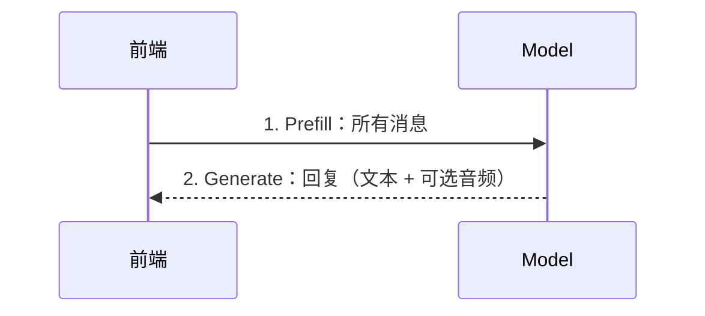
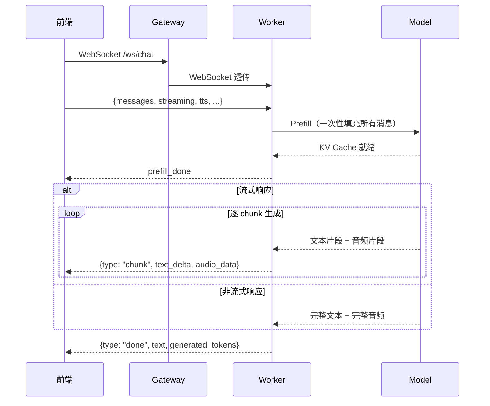

# Chat 模式详解

Turn-based Chat 页面的核心推理模式。通过 `/ws/chat` WebSocket 接口，支持**流式**和**非流式**两种响应方式。

## 一句话理解

> 先把所有历史消息一次性"喂"给模型（**Prefill**），再让模型基于已有上下文生成回复（**Generate**）。

## 整体流程

### 简化视角

前端和模型之间只有两步交互：



### 详细视角

加入中间层（Gateway 透传代理 + Worker 调度）后的完整流程：



## Prefill 阶段

Prefill 将对话历史（system prompt + 多轮 user/assistant 消息）一次性填充到模型的 **KV Cache** 中。

关键行为：
- 使用 `apply_chat_template` 构建 prompt，但 **不加 generation prompt**（`add_generation_prompt=False`）
- generation prompt（`<|im_start|>assistant\n`）在 Generate 阶段才注入
- 支持多模态输入：文本、图片、音频、视频

```python
# 伪代码
prompt = tokenizer.apply_chat_template(msgs, add_generation_prompt=False)
inputs = processor(prompt, images, audios)
inputs_embeds = get_vllm_embedding(inputs)   # 视觉编码
inputs_embeds = get_omni_embedding(inputs)   # 音频编码

# 填充 KV Cache
outputs = llm(inputs_embeds=inputs_embeds, use_cache=True)
kv_cache = outputs.past_key_values
```

## Generate 阶段

Generate 基于已填充的 KV Cache 生成回复。首先注入 bos string，然后分流：

### 注入 bos string

```
<|im_end|>\n<|im_start|>assistant\n<think>\n\n</think>\n\n<|tts_bos|>
```

这与模型在 `chat()` 和 `streaming_generate()` 中的行为一致。

### 非流式生成

使用 HuggingFace 标准的 `llm.generate()` API：

1. bos string → embedding → KV Cache 前向
2. `llm.generate(past_key_values=kv_cache, ...)` 生成完整序列
3. 解码文本
4. 可选：调用 `_generate_speech_non_streaming()` 生成 TTS 音频

适合：短回复、不需要实时反馈的场景。

### 流式生成

使用模型内部的 `streaming_generate()` 方法：

1. bos string 自动注入
2. 每 10 个 token 为一组生成（`ChunkPrefillChunkGenerate`）
3. 每组 token 送入 TTS 生成音频 chunk
4. 逐块 yield (waveform_chunk, text_delta)

适合：长回复、需要实时逐字显示的场景。

## WebSocket 协议

### 端点

```
wss://host/ws/chat
```

### 请求格式

连接后发送一次 JSON：

```json
{
  "messages": [
    {"role": "system", "content": [{"type": "text", "text": "..."}]},
    {"role": "user", "content": "你好"}
  ],
  "streaming": true,
  "generation": {"max_new_tokens": 256, "length_penalty": 1.1},
  "tts": {"enabled": true, "ref_audio_data": "<base64>"},
  "image": {"max_slice_nums": null},
  "omni_mode": false
}
```

| 字段 | 说明 |
|------|------|
| `messages` | 完整消息历史（含 system prompt） |
| `streaming` | `true` 流式 / `false` 非流式 |
| `generation` | 生成参数（max_new_tokens、length_penalty 等） |
| `tts` | Voice Response 配置（enabled、ref_audio_data） |
| `omni_mode` | 视频输入时为 `true` |

### 响应消息

| 类型 | 字段 | 说明 |
|------|------|------|
| `prefill_done` | `input_tokens` | Prefill 完成，返回输入 token 数 |
| `chunk` | `text_delta`, `audio_data` | 流式生成的一个 chunk（仅 streaming=true） |
| `done` | `text`, `generated_tokens`, `input_tokens`, `audio_data` | 生成完成 |
| `error` | `error` | 错误信息 |

## 调用链路

```
前端 turnbased.html
  └─ WebSocket /ws/chat
      └─ Gateway（WS 透传代理）
          └─ Worker /ws/chat
              ├─ chat_prefill()
              │   └─ ChatView.prefill()
              │       └─ model.non_streaming_prefill()
              ├─ TTS init
              │   └─ model.init_token2wav_cache()
              └─ 生成
                  ├─ 流式: chat_streaming_generate()
                  │   └─ ChatView.streaming_generate()
                  │       └─ model.streaming_generate()
                  └─ 非流式: chat_non_streaming_generate()
                      └─ ChatView.generate()
                          └─ model.non_streaming_generate()
```

## Voice Response

前端提供 "Voice Response" 开关：

| 状态 | 行为 |
|------|------|
| 开启 | 生成语音回复 + 文本；自动抑制特殊字符（Markdown `*`、`#`、代码符号等），确保文本适合语音播报 |
| 关闭 | 仅生成文本；不抑制任何字符，可自由输出 Markdown、代码等 |

技术实现：`ChunkPrefillChunkGenerate.chunk_generate()` 的 `suppress_forbidden_tokens` 参数由 `generate_audio` 控制。

## 视频输入

Chat 模式支持视频输入（`VideoContent`）：

1. 前端上传视频文件 → Base64 编码
2. Processor 解码为临时文件 → `get_video_frame_audio_segments()` 提取帧和音频
3. 帧和音频按交错顺序（frame, audio, [stacked_frame], ...）送入模型
4. 请求中自动设置 `omni_mode: true`，`max_slice_nums: 1`
