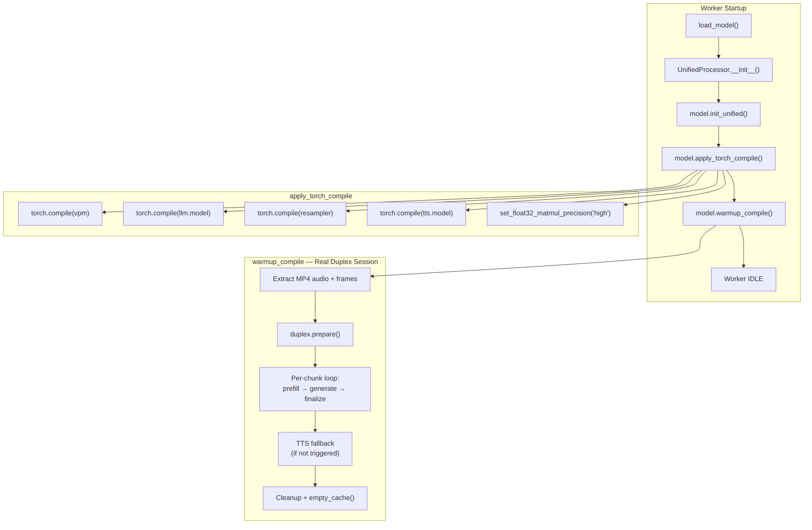

# torch.compile 加速

## 概述

在 A100、RTX 4090 等上一代 GPU 上，Omni Full-Duplex 模式的单 unit 计算耗时约 0.9s，接近 1 秒的实时阈值，会出现明显卡顿。

`torch.compile` 通过 Triton 将核心子模块编译为优化后的 GPU kernel，可将计算耗时降至约 **0.5s**，满足实时要求，实现无卡顿的流畅交互。

## 启用方式

在 `config.json` 中设置：

```json
{
  "service": {
    "compile": true
  }
}
```

## 预编译（推荐）

`torch.compile` 的首次编译（冷启动）耗时约 15 分钟。为避免首次启动服务时的长时间等待，建议提前运行预编译脚本：

```bash
CUDA_VISIBLE_DEVICES=0 PYTHONPATH=. .venv/base/bin/python precompile.py
```

预编译生成的 Triton kernel 缓存保存在 `./torch_compile_cache` 目录下（由 `start_all.sh` 中的 `TORCHINDUCTOR_CACHE_DIR` 环境变量配置）。该缓存持久存储在磁盘上，后续所有启动都会自动复用，无需重复编译。

预编译完成后正常启动服务：

```bash
CUDA_VISIBLE_DEVICES=0,1,2,3 bash start_all.sh
```

Worker 从缓存加载约需 5 分钟（对比冷编译的 15 分钟）。

## 编译链路



## 编译目标

### 被编译的子模块

| 子模块 | 原始类 | 编译理由 |
|--------|--------|---------|
| `vpm` | `SiglipVisionTransformer` | 视觉编码器，计算密集型 Transformer |
| `llm.model` | `Qwen3Model` | LLM 核心 backbone，推理主要耗时点 |
| `resampler` | `Resampler` | 视觉特征重采样，Perceiver 架构 |
| `tts.model` | `LlamaModel` | TTS 核心 backbone，音频 token 生成 |

只编译内层 backbone（如 `llm.model`），不编译外层 wrapper（如 `Qwen3ForCausalLM`），因为外层包含 Python 控制流（`generate()` 循环），编译收益低且容易导致 graph break。

### 不编译的部分

| 子模块 | 原因 |
|--------|------|
| `apm`（Whisper 音频编码器） | streaming 特殊行为 + 动态 shape，compile 收益低 |
| `tts.audio_tokenizer`（Token2Wav/CosyVoice2） | 外部库，非标准 `nn.Module` |
| `MiniCPMO` 外层 | Python 控制流多（chat/streaming/duplex 分支），compile 收益低 |
| `lm_head` | 在外层 wrapper 中，generate 循环内调用 |

## 编译参数

| 参数 | 默认值 | 说明 |
|------|--------|------|
| `mode` | `"default"` | 编译模式 |
| `dynamic` | `True` | 启用动态 shape 支持 |

### 编译模式

| 模式 | 编译耗时 | 运行速度 | 适用场景 |
|------|---------|---------|---------|
| `default` | 中等 | 较快 | 推荐，平衡编译时间和运行速度 |
| `reduce-overhead` | 中等 | 最快 | 使用 CUDA Graphs，仅适合静态 shape |
| `max-autotune` | 很长 | 最快 | 最大优化，编译时间可能数分钟 |

项目默认使用 `mode="default", dynamic=True`，因为推理场景中序列长度、图像尺寸等是动态变化的，`dynamic=True` 避免 shape 变化时重新编译。

### TF32 精度提升

`torch.set_float32_matmul_precision("high")` 启用 TF32 矩阵乘法，在 Ampere+ GPU 上可额外加速约 5-10%，精度损失可忽略。

## warmup_compile() — 真实 Duplex 预热

`torch.compile` 只是包装，**实际的 Triton 内核编译在首次 forward 时触发**。`warmup_compile()` 使用真实 MP4 视频跑一遍完整的 Omni Full-Duplex 推理（prepare → prefill → generate → finalize），在真实推理链路中触发所有 compiled 子模块的 Triton 编译。

### 预热流程

1. **从 MP4 提取素材** — ffmpeg 提取 16kHz 音频按 1s 切 chunk，每秒取 1 帧
2. **加载参考音频** — TTS 声音克隆用
3. **启动 Duplex 会话** — `duplex.prepare()` 初始化 StreamDecoder、预填 system prompt + ref audio
4. **逐 chunk 推理** — 每个 chunk 执行 `streaming_prefill` → `streaming_generate` → `finalize_unit`，触发 vpm / resampler / llm / tts 的 Triton 编译
5. **TTS fallback** — 若 duplex 全程 LISTEN 未触发 TTS，用合成数据单独预热 tts.model
6. **清理** — 重置 duplex 状态、释放 token2wav 缓存、`torch.cuda.empty_cache()`

### 预热日志

每个 unit 会打印详细的阶段耗时：

```
[warmup] unit=0/10 | prefill: vis_proc=120ms vis_emb=8500ms vis_feed=350ms
  aud_proc=45ms aud_emb=1200ms aud_feed=180ms total=10500ms |
  generate: llm=2100ms tts_prep=0ms tts=0ms token2wav=0ms total=2200ms |
  decision=LISTEN | elapsed=125s remaining~875s
```

首个 chunk 因触发 Triton 编译耗时显著更长，后续 chunk 使用已编译的 kernel 会快很多。

## 缓存机制

PyTorch Inductor 内置多层缓存，编译结果持久保存在 `TORCHINDUCTOR_CACHE_DIR` 目录下（项目默认 `./torch_compile_cache`）：

| 缓存层 | 作用 | 默认状态 |
|--------|------|---------|
| Inductor Kernel Cache | 缓存生成的 Triton kernel .so 文件 | 默认开启 |
| FX Graph Cache | 缓存编译后的 FX 计算图 | 默认开启 (PyTorch 2.8+) |
| Autotune Cache | 缓存 kernel 配置的 autotuning 结果 | 默认开启 |

缓存在以下情况下失效，需要重新编译：
- PyTorch 版本升级
- CUDA / Triton 版本变更
- 模型代码结构变化（层数、结构等）
- GPU 架构变更（如从 A100 换到 H100）

## 调用链

```
config.json: "service": { "compile": true }
    ↓
worker.py: WORKER_CONFIG["compile"] = cfg.compile
    ↓
MiniCPMOWorker.__init__(compile=True)
    ↓
UnifiedProcessor.__init__(compile=True)
    ↓
UnifiedProcessor._load_model():
    model.init_unified()
    model.apply_torch_compile(mode="default", dynamic=True)
    model.warmup_compile(ref_audio_path=...)
```

## DuplexCapability 自动获益

`DuplexCapability` 通过**引用**访问模型的 `llm`, `vpm`, `tts` 等子模块，不持有独立副本。`apply_torch_compile()` 后，Duplex 推理自动使用已编译的版本，无需额外操作。

## 性能

| 指标 | 不编译 | 编译后 |
|------|--------|--------|
| Omni Full-Duplex 单 unit 延迟 (A100) | ~0.9s | **~0.5s** |
| 首次启动额外耗时（冷编译） | — | ~15 min |
| 首次启动额外耗时（有缓存） | — | ~5 min |
| 运行时显存占用 | ~21.5 GB | ~21.5 GB |

## 已知限制

- 某些极端输入 shape 可能触发 recompile
- 需要 PyTorch 2.x+，部分旧版 CUDA 驱动可能不兼容 Triton
- 编译后的代码难以单步调试
