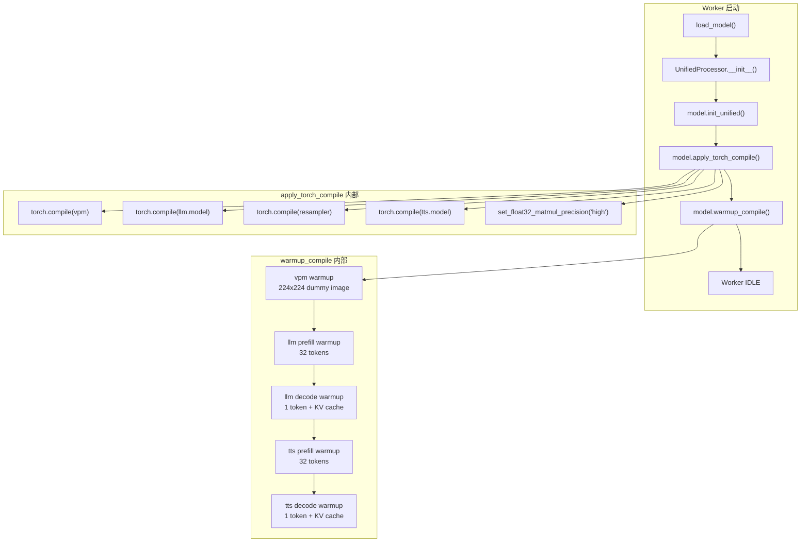

# torch.compile 加速

## 概述

本项目支持通过 `torch.compile` 对核心子模块进行 JIT 编译加速。编译后 Triton 内核替代 PyTorch eager 实现，可获得约 5-20% 的推理加速（取决于模块和硬件）。

该功能为**实验性**，默认关闭。

## 启用方式

### 命令行

```bash
bash start_all.sh --compile
```

### 配置文件

```json
{
  "service": {
    "compile": true
  }
}
```

### Worker 单独启动

```bash
CUDA_VISIBLE_DEVICES=0 PYTHONPATH=. .venv/base/bin/python worker.py \
    --worker-index 0 --gpu-id 0 --compile
```

## 编译链路



## 编译目标

### 被编译的子模块

| 子模块 | 原始类 | 编译理由 |
|--------|--------|---------|
| `vpm` | `SiglipVisionTransformer` | 视觉编码器，计算密集型 Transformer |
| `llm.model` | `Qwen3Model` | LLM 核心 backbone，推理主要耗时点 |
| `resampler` | `Resampler` | 视觉特征重采样，Perceiver 架构 |
| `tts.model` | `LlamaModel` | TTS 核心 backbone，音频 token 生成 |

注意：只编译内层 backbone（如 `llm.model`），不编译外层 wrapper（如 `Qwen3ForCausalLM`），因为外层包含 Python 控制流（`generate()` 循环），编译收益低且容易导致 graph break。

### 不编译的部分

| 子模块 | 原因 |
|--------|------|
| `apm`（Whisper 音频编码器） | streaming 特殊行为 + 动态 shape，compile 收益低 |
| `tts.audio_tokenizer`（Token2Wav/CosyVoice2） | 外部库，非标准 `nn.Module` |
| `MiniCPMO` 外层 | Python 控制流多（chat/streaming/duplex 分支），compile 收益低 |
| `lm_head` | 在外层 wrapper 中，generate 循环内调用 |

## apply_torch_compile() 实现

位于 `MiniCPMO45/modeling_minicpmo_unified.py`。

```python
def apply_torch_compile(self, mode="default", dynamic=True):
    compile_kwargs = dict(mode=mode, dynamic=dynamic)

    self.vpm = torch.compile(self.vpm, **compile_kwargs)
    self.llm.model = torch.compile(self.llm.model, **compile_kwargs)
    self.resampler = torch.compile(self.resampler, **compile_kwargs)
    self.tts.model = torch.compile(self.tts.model, **compile_kwargs)

    torch.set_float32_matmul_precision("high")
    self._compiled = True
```

### 编译参数

| 参数 | 默认值 | 说明 |
|------|--------|------|
| `mode` | `"default"` | 编译模式 |
| `dynamic` | `True` | 启用动态 shape 支持 |

#### 编译模式选择

| 模式 | 编译耗时 | 运行速度 | 适用场景 |
|------|---------|---------|---------|
| `default` | 中等 | 较快 | 推荐，平衡编译时间和运行速度 |
| `reduce-overhead` | 中等 | 最快 | 使用 CUDA Graphs，仅适合静态 shape |
| `max-autotune` | 很长 | 最快 | 最大优化，编译时间可能数分钟 |

项目默认使用 `mode="default", dynamic=True`，因为推理场景中序列长度、图像尺寸等是动态变化的，`dynamic=True` 避免 shape 变化时重新编译。

### TF32 精度提升

`torch.set_float32_matmul_precision("high")` 启用 TF32（TensorFloat-32）矩阵乘法，在 Ampere+ 架构 GPU 上可额外加速约 5-10%，精度损失可忽略。

## warmup_compile() 实现

`torch.compile` 只是包装，**实际的 Triton 内核编译在首次 forward 时触发**。如果不预热，第一个真实请求会承受额外的编译延迟（可能数十秒）。

`warmup_compile()` 用合成数据触发所有编译路径：

### 预热步骤

**1. vpm + resampler**
- 构造 224x224 零值图片（最小尺寸，16x16=256 patches）
- 执行一次 `vpm()` + `resampler()` forward
- 触发视觉编码 Triton 内核编译

**2. llm.model — prefill 路径**
- 构造 32 token 的 dummy embeddings
- 执行 `llm.model(inputs_embeds=..., use_cache=True)` forward
- 触发长序列 prefill 内核编译

**3. llm.model — decode 路径**
- 构造 1 token 的 dummy embeddings + 上一步的 KV cache
- 执行 decode forward
- 触发单 token decode 内核编译（与 prefill 是不同的代码路径）

**4. tts.model — prefill + decode 路径**
- 同 llm.model，分别触发 TTS 的 prefill 和 decode 内核编译

### 为什么需要覆盖两条路径

LLM 和 TTS 的推理分为两个阶段：
- **Prefill**：处理长序列输入，无 KV cache，矩阵 shape 较大
- **Decode**：逐 token 生成，有 KV cache，矩阵 shape 为 1

这两条路径的计算图不同。如果只预热 prefill，首次 decode 时仍会触发 recompile。

### 预热后的清理

```python
torch.cuda.empty_cache()
```

编译过程产生的临时显存在预热完成后释放。

## 调用链

```
config.json: compile=true
    ↓
worker.py: WORKER_CONFIG["compile"] = True
    ↓
MiniCPMOWorker.__init__(compile=True)
    ↓
UnifiedProcessor.__init__(compile=True)
    ↓
UnifiedProcessor._load_model():
    model.init_unified()          # 加载模型 + 双 TTS
    model.apply_torch_compile()   # 包装子模块
    model.warmup_compile()        # 触发编译
```

## DuplexCapability 自动获益

`DuplexCapability` 组件通过**引用**访问模型的 `llm`, `vpm`, `tts` 等子模块，不持有独立副本。因此 `apply_torch_compile()` 后，Duplex 推理自动使用已编译的版本，无需额外操作。

## 性能与注意事项

### 时间开销

| 阶段 | 耗时（典型值） |
|------|---------------|
| `apply_torch_compile()`（包装） | ~1s |
| `warmup_compile()`（实际编译） | ~60s |
| 总额外启动时间 | ~60s |

### 显存影响

- 编译过程中会临时占用额外显存（编译器中间表示）
- 预热完成后通过 `torch.cuda.empty_cache()` 释放
- 运行时显存占用与非编译模式基本相同

### 已知限制

- **实验性**：某些极端输入 shape 可能触发 recompile
- **首次推理延迟**：如果遇到未覆盖的代码路径，仍可能触发 recompile
- **兼容性**：需要 PyTorch 2.x+，部分旧版 CUDA 驱动可能不兼容 Triton
- **调试困难**：编译后的代码难以单步调试

## 基准测试

项目提供了 Duplex A/B 对比基准测试脚本：

```bash
PYTHONPATH=. .venv/base/bin/python tests/bench_duplex_ws.py
```

该脚本对 normal 和 compile 模式各跑多轮，统计 LISTEN/SPEAK 稳态性能。需要同时运行两个 Worker（一个 normal，一个 compile）分别在不同端口上。
