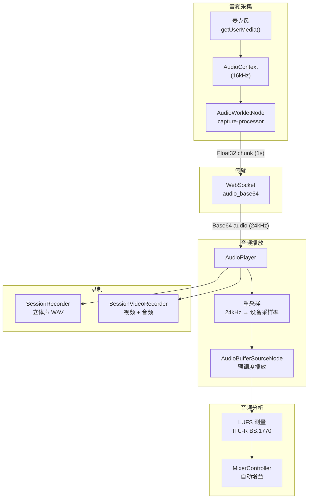
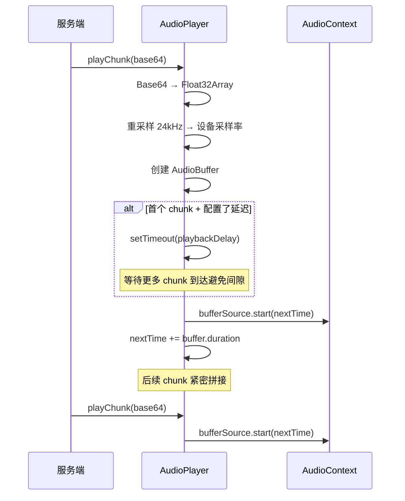

# 前端音频处理架构

## 架构总览



---

## capture-processor.js — AudioWorklet 音频采集

运行在 Web Audio 渲染线程的 `AudioWorkletProcessor`，实现低延迟音频捕获。

### 工作原理

```javascript
process(inputs, outputs) {
    // 1. 直通到输出（用于 MediaStreamDestination）
    output.set(input);
    // 2. 累积到 _buffer
    _buffer = concat(_buffer, input);
    // 3. buffer 满一个 chunk 时发送
    while (_buffer.length >= _chunkSize) {
        const chunk = _buffer.slice(0, _chunkSize);
        _buffer = _buffer.slice(_chunkSize);
        port.postMessage({type: 'chunk', audio: chunk}, [chunk.buffer]);
    }
}
```

### 配置

| 参数 | 默认值 | 说明 |
|------|--------|------|
| `chunkSize` | 16000 | 每个 chunk 的样本数 |
| 采样率 | 16000 Hz | 由 AudioContext `sampleRate` 决定 |
| chunk 时长 | 1 秒 | chunkSize / sampleRate |

### MessagePort 通信

**接收命令**：
- `{command: 'start'}` — 开始累积和发送 chunk
- `{command: 'stop'}` — 停止，发送剩余 buffer（`final: true`）

**发送消息**：
- `{type: 'chunk', audio: Float32Array}` — 正常 chunk
- `{type: 'chunk', audio: Float32Array, final: true}` — 最后一个 chunk

使用 `Transferable` 对象（`[chunk.buffer]`）实现零拷贝传输。

---

## audio-player.js — AI 音频实时播放器

`AudioPlayer` 类管理从服务端接收的 AI 音频的实时无间隙播放。

### 完整 API

| 方法 | 说明 |
|------|------|
| `init()` | 初始化 AudioContext |
| `beginTurn()` | 开始新的说话轮次（重置调度时间） |
| `playChunk(base64Data, arrivalTime)` | 入队并调度一个音频 chunk |
| `endTurn()` | 结束当前轮次 |
| `stopAll()` | 立即停止所有播放（强制监听时使用） |
| `stop()` | 完整停止并清理 |

| 属性 | 说明 |
|------|------|
| `turnActive` | 是否处于说话轮次 |
| `playing` | 是否正在播放 |
| `gapCount` | 间隙总数 |
| `totalShiftMs` | 总漂移时间 |
| `lastAheadMs` | 最后的前置缓冲时间 |

### 播放流程



### 间隙检测

当 `nextTime < AudioContext.currentTime` 时检测到间隙（buffer underrun）：

```
gapMs = (currentTime - nextTime) * 1000
if gapMs > 10ms:
    gapCount++
    totalShiftMs += gapMs
    nextTime = currentTime + 小偏移    // 修正
    触发 onGap 回调
```

间隙通常由网络延迟或推理速度慢导致。

### 播放延迟

通过 `getPlaybackDelayMs()` 配置（默认 200ms，对应 `config.json` 中的 `playback_delay_ms`）。

- 延迟越大 → 缓冲越多 → 播放越平滑，但首音延迟越高
- 延迟为 0 → 收到即播放，可能有间隙

### 回调

- `onMetrics(data)` — 指标上报：`{ahead, gapCount, totalShift, turn, pdelay}`
- `onGap(info)` — 间隙事件：`{gap_idx, gap_ms, total_shift_ms, chunk_idx, turn}`
- `onRawAudio(samples, sampleRate, timestamp)` — 原始音频数据（供 SessionRecorder 使用）

---

## lufs.js — LUFS 响度测量

实现 **ITU-R BS.1770** 集成响度测量算法。

### 算法步骤

1. **K 加权滤波**：两级 IIR 滤波器（高通 + 高频增益），模拟人耳频率感知
2. **分块均方值**：将信号分为 400ms 重叠块，计算每块的均方值
3. **绝对门限**：去除低于 -70 LUFS 的静音块
4. **相对门限**：计算剩余块的平均值，去除低于平均值 -10 dB 的块
5. **集成响度**：计算最终块的加权平均 → LUFS 值

### 用途

- `MixerController` 用于实时音频电平监控
- `FileAudioProvider` 用于音频文件归一化（调整增益使响度一致）

---

## mixer-controller.js — 混音器控制

`MixerController` 提供双通道音频混音控制界面。

### 功能

| 功能 | 说明 |
|------|------|
| 实时 LUFS 计量 | 分别显示用户和 AI 音频的实时响度 |
| 自动增益 | 基于 LUFS 自动调整 AI 音频音量 |
| 独立音量控制 | 用户/AI 音量滑块独立调节 |
| 可拖动面板 | 浮动面板 UI，可拖拽到任意位置 |

---

## duplex-utils.js — 工具函数

| 函数 | 说明 |
|------|------|
| `resampleAudio(input, srcRate, dstRate)` | 线性插值重采样 |
| `float32ToBase64(float32Array)` | Float32 数组 → Base64 字符串 |
| `base64ToFloat32(base64)` | Base64 字符串 → Float32 数组 |

重采样逻辑：计算采样率比值，按线性插值对每个目标样本点取两个最近源样本点的加权平均。

---

## stereo-recorder-processor.js — 立体声处理器

`AudioWorkletProcessor` 实现，用于 `SessionRecorder` 的立体声录制：
- 接收两路音频输入（用户 + AI）
- 交织为立体声帧（左 = 用户，右 = AI）
- 通过 MessagePort 发送立体声 PCM 数据

---

## queue-chimes.js — 排队音效

使用 Web Audio API 合成排队状态音效：
- 入队时：低音提示
- 排队完成时：高音提示
- 纯合成音，无外部音频文件依赖
