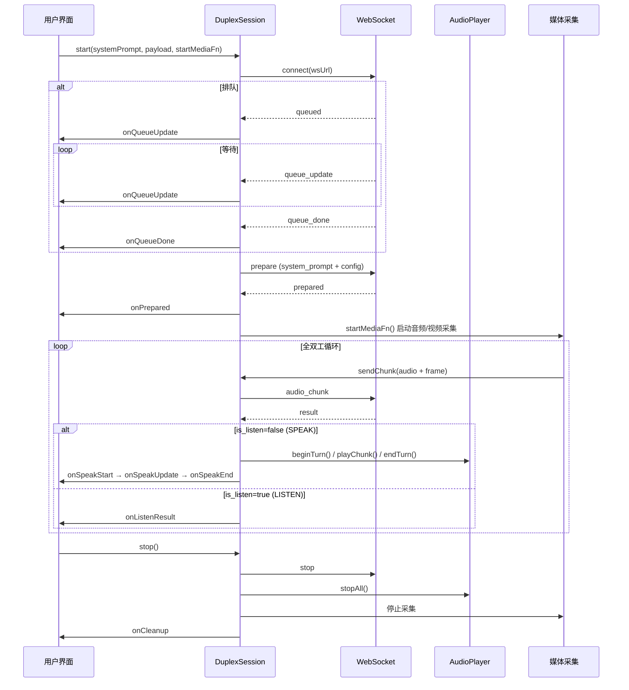
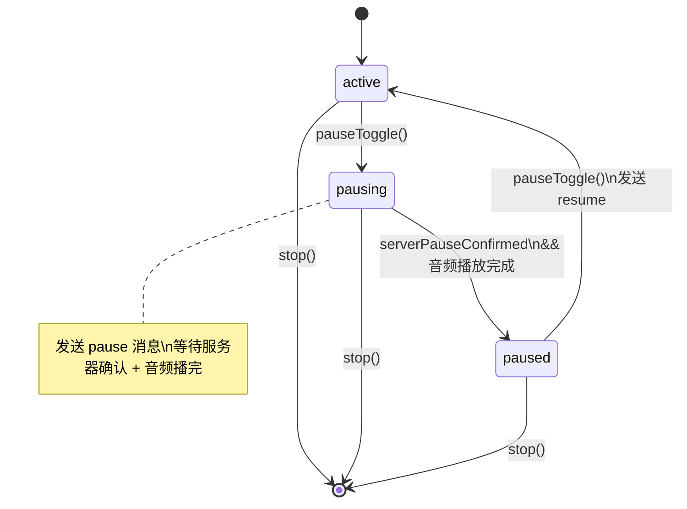

# 双工会话管理

## DuplexSession 类

`DuplexSession`（`duplex/lib/duplex-session.js`）是双工模式的核心会话管理类，封装 WebSocket 生命周期、消息协议、状态机和音频播放集成。

### 构造函数

```javascript
new DuplexSession({
    prefix: 'omni',              // 会话 ID 前缀 ('omni' | 'adx')
    getMaxKvTokens: () => 8192,  // KV Cache 上限
    getPlaybackDelayMs: () => 200,// 播放延迟
    outputSampleRate: 24000,     // 音频输出采样率
    getWsUrl: (sid) => `...`,    // WebSocket URL 生成
})
```

### 完整方法列表

| 方法 | 说明 |
|------|------|
| `start(systemPrompt, preparePayload, startMediaFn)` | 启动会话：连接 WS → 排队 → prepare → 启动媒体采集 |
| `sendChunk(msg)` | 发送音频 chunk（自动注入 `force_listen` 标志） |
| `pauseToggle()` | 切换暂停/恢复 |
| `toggleForceListen()` | 切换强制监听模式 |
| `stop()` | 停止会话 |
| `cancelQueue()` | 取消排队 |
| `cleanup()` | 完整清理（WS 关闭 + AudioPlayer 停止） |

### 回调钩子

| 回调 | 参数 | 触发时机 |
|------|------|---------|
| `onSystemLog(text)` | 日志文本 | 系统事件（连接/断开/错误） |
| `onQueueUpdate(data)` | `{position, eta_seconds}` | 排队状态变化 |
| `onQueueDone()` | — | 离开队列，开始处理 |
| `onSpeakStart(text)` | 首段文本 | AI 开始说话 |
| `onSpeakUpdate(handle, text)` | 累积文本 | AI 说话文本更新 |
| `onSpeakEnd()` | — | AI 说话结束 |
| `onListenResult(result)` | 完整 result | 模型处于聆听状态 |
| `onExtraResult(result, recvTime)` | 原始结果 | 每个 result 都触发（用于指标） |
| `onPrepared()` | — | 准备完成 |
| `onCleanup()` | — | 会话清理完成 |
| `onMetrics(data)` | 音频指标 | AudioPlayer 指标更新 |
| `onRunningChange(running)` | bool | 运行状态变化 |
| `onPauseStateChange(state)` | 状态字符串 | 暂停状态变化 |
| `onForceListenChange(active)` | bool | 强制监听状态变化 |

---

## 会话生命周期



---

## 状态机

### 暂停状态机



**pausing → paused 转换条件**：
- 服务器返回 `paused` 确认消息（`serverPauseConfirmed = true`）
- AudioPlayer 当前没有正在播放的音频

两个条件都满足时 `_tryCompletePause()` 将状态推进到 `paused`。

### 强制监听模式

`forceListenActive` 标志在每个 `sendChunk()` 中注入到消息的 `force_listen` 字段。开启时：
- Worker 端 `duplex_generate(force_listen=True)` 强制模型输出 `<|listen|>`
- AudioPlayer 立即 `stopAll()` 停止当前播放
- 用于用户想打断 AI 说话的场景

### KV Cache 自动停止

当 result 中的 `kv_cache_length >= maxKvTokens` 时，DuplexSession 自动调用 `stop()`，防止 KV Cache 溢出。

---

## WebSocket 消息协议

### 客户端 → 服务端

| 类型 | 字段 | 说明 |
|------|------|------|
| `prepare` | `system_prompt`, `config`, `ref_audio_base64`, `tts_ref_audio_base64`, `max_slice_nums`, `deferred_finalize` | 初始化双工会话 |
| `audio_chunk` | `audio_base64`, `frame_base64_list`, `force_listen`, `max_slice_nums` | 发送音频 + 视频帧 |
| `pause` | `timeout` | 暂停请求 |
| `resume` | — | 恢复请求 |
| `stop` | — | 停止会话 |
| `client_diagnostic` | `metrics` | 客户端诊断信息 |

### 服务端 → 客户端

| 类型 | 字段 | 说明 |
|------|------|------|
| `queued` | `ticket_id`, `position`, `eta_seconds` | 入队通知 |
| `queue_update` | `position`, `eta_seconds` | 位置更新 |
| `queue_done` | — | 离开队列 |
| `prepared` | `prompt_length`, `recording_session_id` | 准备完成 |
| `result` | `is_listen`, `text`, `audio_data`, `end_of_turn`, `cost_*_ms`, `kv_cache_length` | 单步结果 |
| `paused` | `timeout` | 暂停确认 |
| `resumed` | — | 恢复确认 |
| `stopped` | — | 已停止 |
| `timeout` | `reason` | 暂停超时 |
| `error` | `error` | 错误 |

---

## 会话录制系统

### SessionRecorder（立体声 WAV）

用于 Audio Duplex 模式，录制双声道 WAV 文件：
- **左声道**：用户音频（来自 AudioWorklet 采集的 PCM）
- **右声道**：AI 音频（来自 AudioPlayer 的 `onRawAudio` 回调）
- 精确时间对齐：基于 AudioContext 时间戳

### SessionVideoRecorder（视频 + 音频）

用于 Omni 模式，录制视频 + 立体声音频：

**三层回退策略**：
1. `videoEl.captureStream()` — 首选方案
2. `srcObject` 克隆 — Safari 兼容
3. Canvas `drawImage` 循环 — 字幕合成模式

**字幕合成**：
- 通过 Canvas `drawImage` 绘制视频帧
- 在帧上叠加 AI 说话文本（字幕）
- 合成后的帧流传给 MediaRecorder

**音频混合**：
- 使用 `stereo-recorder-processor.js` AudioWorklet
- 交织用户和 AI 音频为立体声

### recording-settings.js

录制设置面板，可配置：
- 视频格式（WebM / MP4）
- 视频质量
- 是否启用字幕
- 是否启用录制
